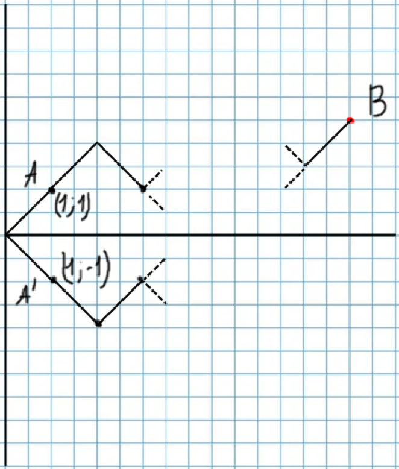

#### Вопрос 2

##### Принцип отражения . Теорема о баллотировке.

*Лемма (принцип отражения).* Число путей из $A$ в $B$, которые **касаются или пересекают ось** $x$, равно числу всех путей из $A'$ в $B$. 

*Теорема о баллотировке.* Пусть $x>0,\;y>0$, число путей $\{s_1,\dots,s_x=y\}$ из числа координат в точку $(x,y)$, таких, что $s_1>0, \dots, s_x>0$ (путь всегда выше абсцисс) равно $(y/x)N_{x,y}.$ 

*Формулировка как в книжке "Теорема о баллотировке"*: Если при баллатировке кандидат *А* набирает *а* голосов, а кандидат *B* набирает *b* голосов, причем $a \geq b$, то вероятность того, что при последовательном подсчете бюллетеней число голосов, отданных за *А*, за все время голосованние было больше числа отданых за *B* равна 
$$
P=\frac{a-b}{a+b}
$$
  *Доп. факт*: если требуется не просто привосходство, а еще и в более чем *m* раз, то 
$$
P=\frac{a-mb}{a+b}
$$
