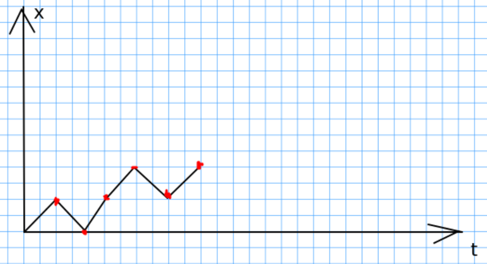

#### Вопрос 3

##### Случайные блуждания. Вычисление вероятностей $p_{n,r}, u_{2n}, f_{2n}$

Производится $N$ бросаний правильной монеты. При этом $\varepsilon_k = \pm 1$ при победе или поражении соответственно. Тогда $s_k = \sum\limits_{i=1}^k\varepsilon_i$ - разность между числом гербов и решек после каждого $k$-го броска. Каждый возможный исход $N$ бросаний правильной монеты можно интерпретировать как некоторый путь из начала координат. 

Очевидно, в случае $k+1$ броска монеты, событие, зависящее от исхода первых $k$ испытаний, имеет вероятность, которая не зависит от $N$. 

Для отслеживания текущего состояния удобно ввести частицу, которая в одинаковые моменты времени будет двигаться вверх или вниз в зависимости от того, какая сторона монеты выпала. 

Мы будем говорить, что частица совершает симметрическое случайное блуждание. 

Для случайных блужданий переопределены следующие величины
$$
u_{2n}=C^n_{2n}\cdot 2^{-2n},\;\;\; n=0,1,2,\dots
$$

$$
f_{2n}=u_{2n-2}-u_{2n},\;\;\; n=0,1,2,\dots
$$

$$
p_{2k,2n}=u_{2k}u_{2n-2k}
$$

где $u_{2n}$ - вероятность того, что в течении всего времени от 0 до $2n$ частица находится на положительной стороне; $f_{2n}$ - вероятность вернуться в начало координат; $p_{2k, 2n}$ - вероятность того, что в интервале времени от 0 до $2n$ частица проводит $2k$ единиц времени на положительной стороне.