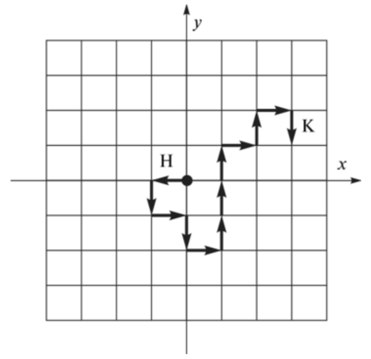
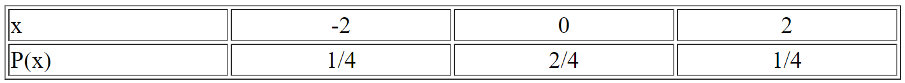

#### Вопрос 8

##### Двойственные случайные блуждания. Получение новых вероятностных соотношений для двойственных блужданий.

Выходя из начала координат (0;0), частица с равной вероятностью сдвигается на один шаг либо на юг, либо на север, и одновременно (и тоже с равной вероятностью) на один шаг либо на восток, либо на запад. После того как шаг сделан, движение продолжается аналогичным образом из нового положения и так далее до бесконечности. Какова вероятность того, что частица когда-нибудь вернется в начало координат?

Прежде всего, сколько раз частица вернется в начало? Вероятность ровно *x* возвращений есть $P^xQ$, так как после каждого возвращения частицу можно рассматривать как снова выходящую из начала. Если бы $P$ было известно, то среднее число возвращений в начало координат можно было бы найти, суммируя геометрический ряд вида $u = \sum\limits_{x=1}^{\infty}xP^xQ$.  

Выходя из начала, частица может попасть в него обратно лишь после четного числа шагов. Более того, ее путь может быть представлен как «произведение» двух независимых одномерных случайных блужданий, каждое из которых начинается в начале координат, и одно происходит в вертикальном направлении, а другое - в горизонтальном направлении. После двух шагов горизонтальная компонента x имеет распределение

После $2n$ шагов вероятность того, что частица вернулась в начало координат равняется 
$$
p_{2n}=\left[\begin{pmatrix}
2n\\
n
\end{pmatrix}\cdot
\left(\frac{1}{2}\right)^{2n}\right]^2
$$
так как для осуществления этого события мы должны иметь равные количества шагов как по вертикали, так и по горизонтали.

Просуммируем теперь приближенные выражения для этих вероятностей и найдем математическое ожидание числа возвращений. Для больших значений n можно применить формулу Стирлинга, и получить
$$
\begin{pmatrix}
2n\\
n
\end{pmatrix}\cdot
\left(\frac{1}{2}\right)^{2n}=\frac{(2n)!}{n!\cdot n!}\cdot\left(\frac{1}{2}\right)^{2n}\approx\frac{\sqrt{2\pi}\cdot(2n)^{2n+1/2}\cdot e^{-2n}}{\left(\sqrt{2\pi}\cdot n^{n+1/2}\cdot e^{-n}\right)\cdot 2^{2n}} \approx \frac{1}{\sqrt{\pi n}}
$$
