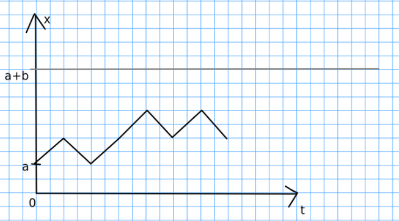

#### Вопрос 09

##### Различные подходы к решению задачи о разорении.

*(Прим. Решение взято с notion)*

*Условие*. Два игрока играют в безобидную игру (вероятность выиграть и проиграть равна 1/2). Начальный капитал игрока $A$ равен $a$, игрока $B$ - $b$. В каждой партии игрок $A$ выигрывает или проигрывает 1 монету относително $b$. $p$ - вероятность выигрыша $A$, $q$ - вероятность выигрыша $B$. Найти вероятность разорения игроков.

**4 подхода к решению задачи о разорении**

- Графический;
- Аналитический (случайное блуждание на отрезке с поглощением);
- На марковских цепях;
- Через процессы, не зависящие от будущего.

Далее подробнее о каждом из них.

**Графический способ.**

$$
\xi_i = \begin{cases}
        1, & p(1) = 1/2\\
        -1, & p(-1) = 1/2
        \end{cases}
$$

$S_n = \xi_1 + \dots + \xi_n + a$ - капитал игрока $A$ после $n$ партий.

Разорение происходит, если $x=0$ или $x=a+b$.

**Аналитический (случайное блуждание на отрезке с поглощением).**

Обозначим $Q_x$ - вероятность попадания из $x$ в 0. Рассмотрим случай для небезобидной игры, где $q$ - вероятность проигрыша, $p$ - вероятность выигрыша.

$$
Q_1 = \begin{cases}
        \frac{q}{p}, & q < p\\
        1, & q \ge p
        \end{cases}
$$

$$
Q_a = \begin{cases}
        (\frac{q}{p})^a , & p > \frac{1}{2}\\
        1, & p \le \frac{1}{2}
      \end{cases}
$$

$Q_a$ - вероятность попасть в начало из точки $x=a$.

$Q_a = P_1(\text{попасть в начало, не доходя до } x=a+b) + P(\text{дойти до } x=a+b) \cdot P(\text{попасть в начало из точки } x=a+b)$. $P_1$ - вероятность разорения игрока $A$.

$$
P_1 = \frac{(\frac{q}{p})^a - (\frac{q}{p})^{a+b}}{1-(\frac{q}{p})^{a+b}}
$$

При безобидной игре получаем неопределенность и с помощью пределов получим следующее:

$P_1 = \lim_{x \to 1} \frac{x^a-x^{a+b}}{1-x^{a+b}} = \frac{b}{a+b}$

**На марковских цепях.**

Пусть для примера начальные капиталы игроков равны $a=2$, $b=3$. $X_i = i$, $i \in \overline{0,5}$. 

Если $i \ne 0$, $i \ne 5$, то $P(X_i \rightarrow X_{i+1}) = 1/2 = P(X_i \rightarrow X_{i-1})$. 

При $i=0$ $P(X_0 \rightarrow X_i) = 0$, $P(X_0 \rightarrow X_0) = 1$. 

При $i=5$ $P(X_5 \rightarrow X_i) = 0$, $P(X_5 \rightarrow X_5) = 1$.

Это блуждание представляет собой цепь Маркова из 6 состояний и матрицей перехода

$$
\pi = \begin{pmatrix}
        1&0&0&0&0&0\\
        1/2&0&1/2&0&0&0\\
        0&1/2&0&1/2&0&0\\
        0&0&1/2&0&1/2&0\\
        0&0&0&1/2&0&1/2\\
        0&0&0&0&0&1
      \end{pmatrix}
$$

**Через процессы, не зависящие от будущего**

Введём случайные величины $\xi_k$, изображающие выигрыш первого игрока в $k$-й партии.

$$\xi_k=
    \begin{cases}
        1 &\text{с вероятностью 1/2}\\
        -1 &\text{с вероятностью 1/2}
    \end{cases}$$

Число $a+S_k=a+\sum_{j=1}^k{\xi_j}$ будет означать капитал первого игрока, а $b-S_k$ - капитал второго игрока после $k$ партий. Величина

$$\eta=\min{\{k:a+S_k=0 \text{ или } b-S_k\}}$$

есть время до окончания игры, т.е. до разорения одного из игроков. Спрашивается, чему равна вероятность $P_i$ того, что выигрыает $i$-й игрок($i=1,2$)?

Ясно, что $\eta$ есть марковский момент, при этом $S_{\eta}=-a$ с вероятностью $P_2$ и $S_{\eta}=b$ с вероятностью $P_1=1-P_2$. Поэтому 

$$MS_{\eta}=P_1 b-P_2 a$$

Если $M\eta<\infty$, то в силу тождества Вальда мы имели бы 

$$P_1b-P_2a=M\eta M\xi_1=0$$

Отсюда находим, что $P_1=a/(a+b)$, $P_2=b/(a+b)$.

Остаётся проверить конечность $M\eta$. Пусть для простоты $a+b=2z$ - чётно. С вероятностью $2^{-\min{(a,b)}}\ge 2^{-z}$ игра может закончиться за $\min{(a,b)} \le z$ партий. Так как в течение игры суммарный капитал обоих игроков не меняется, то

$$P(\eta>z)\le1-2^{-z},\dotsc,P(\eta>zN)<(1-2^{-z})^N$$

Это, очевидно, влечёт за собой конечность

$$M\eta=\sum_{k=0}^{\infty}P(\eta>k)$$
