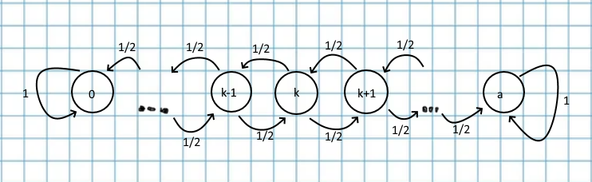

### Блок 4. *Цепи Маркова*

#### Вопрос 1

##### Определения. Примеры. Матрица перехода

*Определение 1*. Последовательность $\{X_n \}_0^\infty$ образует цепь Маркова, если 
$$
P(X_n = j | X_0 = k_0,X_1 = k_1,\ldots, X_{n-2} = k_{n-2},X_{n-1 = i}) = P(X_n=j|X_{n-1} = i) = p_{ij}^{(n)}
$$
Таким образом, цепь Маркова можно представить себе как некоторую систему с возможными состояниями {$E_1,E_2,\ldots,$}. Главное свойство марковских цепей: при фиксированном настоящем будущее и прошлое последовательности {$X_n$} независимы.

*Определение 2*. Марковская цепь $\{X_n \}_0^\infty$ называется однородной, если вероятности $p_{ij}^{(n)}$ не зависят от *n*. То есть вероятность перехода из $E_i$ в $E_j$ одинакова в любой момент времени.

*Определение 3*. Состояние $E_i$ называют несущественным, если существует такое состояние $E_j$ и целое $t_0 > 0$, что $p_{ij}(t_0) > 0, p_{ji}(t) = 0$ для любого целого *t*. То есть попасть в состояние можно, но вернуться из него обратно - нет. В противном случае - состояние существенное.

Существенные состояние $E_i$ и $E_j$ называются сообщающимися, если существуют такие целые числа $t>0$ и $s > 0$, что $p_{ij}(t) > 0$ и $p_{ji}(s) > 0$. То есть из одного состояния можно прийти в другое, а из другого - в первое.

*Определение 4* Цепь Маркова, состоящая из одного класса существенных, сообщающихся состояний, называется неразложимой (неприводимой). Если цепь содержит более одного такого класса, то разложимой.

Матрица переходных вероятностей

$\begin{pmatrix} P_{11} & P_{12} & \ldots & P_{1n} \\ P_{21} & P_{22} & \ldots & P_{2n} \\ \ldots &\ldots & \ldots & \ldots \\ P_{n1} & P_{n2} & \ldots & P_{nn} \end{pmatrix}$ ​, где $P_{ij}$ - вероятность перехода напрямую из состояния $i$ в $j$.

Сумма по строке всегда должна быть равна единице, а по столбу - необязательно.

*Пример 1*. Блуждание с поглощением и отражением.

Пусть $a > 0$ - целое число. Рассмотрим блужданием частицы по целым точкам между 0 и $а$. Если $0 < k < a$, то из точки $k$ с вероятностями 1/2 частица переходит в $k-1$ или $k+1$. Если $k$ равно 0 или $a$, то частица остается в точке $k$ с вероятностью 1. Это так называется блуждание с поглощением. Если $X_n$ - случайная величина, равная координате частицы в момент $n$, то последовательность {$X_n$} образует цепь Маркова, так как условное распределение случайной величины $X_n$ зависит только от значения $X_{n-1}$. Легко увидеть, что эта цепь однородна.

Если же частица из точки 0 с вероятностью 1 переходит в точку 1, а из точки $a$ с вероятностью 1 в точку $a_1$, то получим блуждание с отражением. Ясно, что и в этом случае положения частицы $X_n$ будут связаны в однородную цепь Маркова.  

