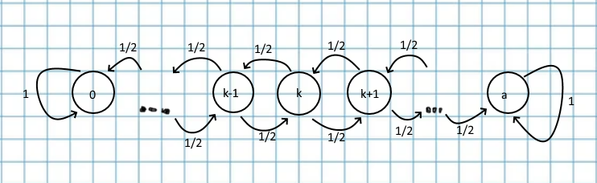

#### Вопрос 2

##### Блуждания с поглощением и отражением. Классификация состояний. Классы состояний

*Определение 1.* Состояние $E_i$ называют несущественным, если существует такое состояние $E_j$ и целое $t_0 > 0$, что $p_{ij}(t_0) > 0, p_{ji}(t) = 0$ для любого целого t. То есть попасть в состояние можно, но вернуться из него обратно - нет. В противном случае - состояние существенное.

Существенные состояние $E_i$ и $E_j$ называются сообщающимися, если существуют такие целые числа $t>0$ и $s > 0$, что $p_{ij}(t) > 0$ и $p_{ji}(s) > 0$. То есть из одного состояния можно прийти в другое, а из другого - в первое.

*Определение 2.* Состояние $E_j$ называется возвратным, если $F_j$ = 1, и невозвратным, если $F_j$ < 1, где $F_j = \sum \limits_{n=1}^\infty f_j(n)$, где $f_j(n) = P(X_n=j,X_{n-1} \neq j,\ldots,X_1 \neq j|X_0=j)$. $f_j(n)$ - вероятность, начав в состоянии *j*, вернутся в него на *n*-ом шаге, и тогда $F_j$ - вероятность когда либо вернутся в состояние *j*

Состояние $E_j$ называется *нулевым*, если $p_{jj}(n) \rightarrow 0$ при $n \rightarrow \infty$, и ненулевым в противном случае.

Состояние $E_j$ называется *периодическим* с периодом $d_j$, если возвращение с положительной вероятностью в $E_j$ возможно только за число шагов, кратное $d_j > 1$ и $d_j$ есть наибольшее число, обладающее этим свойством.

**Блуждание с поглощением и отражением**.

Пусть $a > 0$ - целое число. Рассмотрим блужданием частицы по целым точкам между 0 и $а$. Если $0 < k < a$, то из точки $k$ с вероятностями 1/2 частица переходит в $k-1$ или $k+1$. Если $k$ равно 0 или $a$, то частица остается в точке $k$ с вероятностью 1. Это так называется блуждание с поглощением. Если $X_n$ - случайная величина, равная координате частицы в момент $n$, то последовательность {$X_n$} образует цепь Маркова, так как условное распределение случайной величины $X_n$ зависит только от значения $X_{n-1}$. Легко увидеть, что эта цепь однородна.

Если же частица из точки 0 с вероятностью 1 переходит в точку 1, а из точки $a$ с вероятностью 1 в точку $a_1$, то получим блуждание с отражением. Ясно, что и в этом случае положения частицы $X_n$ будут связаны в однородную цепь Маркова.  

$E_0, E_a$ - существенные

$E_1, E_2,...E_k,...,E_a-1$ - несущественные

$E_1, E_2,...E_k,...,E_a-1$ - невозвратные

$E_1, E_2,...E_k,...,E_a-1$ - переодические с периодом 2 (*Док-во*: число шагов "отдалений" от исходного состояние равно числу "приближений" к исходному состоянию. "отдалений" + "приближений" - четное)
