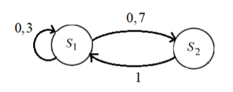

#### Вопрос 4

##### Стационарное распределение. Эргодическая теорема (без доказательства). Примеры вычисления стационарных вероятностей.

*Теорема 8* (Эргодическая). 

(1) Существует состояние $E_s$ такое, что время $\tau^{(s)}$ возвращения в $E_s (P(\tau^{(s)}= n) = f_s(n))$ имеет конечное математическое ожидание $E\tau^{(s)} < \infty$.

(2) Цепь неразложима

(3) Цепь непериодична

Условия (1-3) необходимы и достаточны для того, чтобы при любых $i$ и $j$ существовали не зависящие от $i$ положительные пределы $\lim\limits_{n\rightarrow\infty} p_{ij}(n) = \pi_j >0, i,j =0,1,2,\ldots$

Числа $\{\pi_j \}$ являются единственным в классе последовательностей, образующих абсолютно сходящиеся ряды, решением системы уравнений: $\begin{cases} \sum \limits_{j=0}^∞ \pi_j=1 \\ \pi_j=\sum \limits_{k=0}^∞\pi_k p_{kj};\;j=0,1,2...\end{cases}$(2)

Кроме того, $E_{t^{(s)}}<∞$ при всех $j$ и числа $\pi_j=(Et^{(j)})^{-1}$ допускают представление $\pi_j=(Et^{(j)})^{-1}=(Et^{(s)})^{-1}\sum \limits_{k=1}^∞P_s(k,j)$ при любом s

Цепь, обладающая свойством (1) — эргодическая

Распределение $\{\pi_j\}$-стационарное

Свойство (2) выражает инвариантность распределения относительно переходных вероятностей

Числа $\pi_j$ есть, по существу, вероятности попадания системы в состояние $E_j$ через большой интервал времени. При этом оказывается, что эти вероятности не зависят от начального состояния системы. Система "забывает", откуда началось движение. Распределение {$\pi_j$} называют стационарным или инвариантным.

*Пример*

Найдем стационарное распределение:

Матрица переходов 
$$
P=(p_{ij})=
\begin{pmatrix}
0,3 & 0.7 \\
1 & 0
\end{pmatrix}
$$
Стационарное распределение будет иметь вид $\pi = (\pi_1, \pi_2)$. Мы знаем, что вектор распределения вероятностей на любом шаге можно найти по рекуррентной формуле $p(n)=p(n-1)P$. Т.к. по своству стационарного распределения оно обозначает, что распределение вероятностей на шаге $n \rightarrow \infin$ не отличается от распределения на шаге $n+1 \rightarrow \infin$. Получаем что
$$
\pi=\pi \cdot P \\
\begin{cases}
0,3\pi_1+\pi_2=\pi_1 \\
0,7\pi_1+0\pi_2=\pi_2 \\
\pi_1 + \pi_2 = 1
\end{cases}
$$
Решив систему получим 
$$
\begin{cases}
\pi_1=\frac{10}{17}\\
\pi_2=\frac{7}{17}
\end{cases}
$$
*Переводя на человеческий язык*: данная система, независимо от начального состояния, на шаге $n \rightarrow \infin $ будет с вероятностью $\pi_1$ в состоянии $S_1$ (или с вероятностью $\pi_2$ в состоянии $S_2$)
