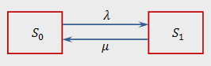

#### Вопрос 05

##### Расчет основных показателей одноканальных СМО с отказом.

**Система массового обслуживания**

*Система массового обслуживания (СМО)* — система, которая производит обслуживание поступающих в неё требований.

$\lambda$ - плотность потоков, поступающих в систему заявок;

$\mu$ - интенсивность обслуживания заявок одним каналом;

$T_{пр}$ - время простоя канала;

$T_{об}$ - среднее время обслуживания;

$$
\mu = \frac{1}{T_{об}} \;\;\; \lambda = \frac{1}{T_{пр}}
$$

**СМО с отказами**

В *СМО с отказами* заявка, поступившая в момент, когда все каналы заняты, получает отказ, покидает СМО и в
дальнейшем процессе обслуживания не участвует. 

**Одноканальная СМО с отказами**

*Формулировка*: Имеется один канал, на который поступает поток заявок с интенсивностью $\lambda$. Поток обслуживаний имеет интенсивность $\mu$.

Одноканальная СМО с отказами имеет два состояния:

1. $S_0$ - канал свободен;
2. $S_1$ - канал занят.

Граф состояний СМО:

В предельном, стационарном режиме система алгебраических уравнений для вероятностей состояний имеет вид:

$$
\begin{cases}
\lambda \cdot p_0 = \mu \cdot p_1 \\
\mu \cdot p_1 = \lambda \cdot p_0
\end{cases}
$$

Система вырождается в одно уравнение. Учитывая нормировочное условие $p_0$ + $p_1 = 1$ найдём предельные вероятности:

$$
p_0 = \frac{\mu}{\lambda + \mu} \;\;\; p_1 = \frac{\lambda}{\lambda + \mu}
$$

Они выражают среднее относительное время пребывания системы в состоянии $S_0$ (канал свободен) и $S_1$ (канал занят), т.е. определяют относительную пропускную способность(средняя доля поступивших заявок, обслуживаемая системой) $Q$ системы и вероятность отказа $P_{отк}$(вероятность того, что заявка покинет СМО необслуженной):

$$
Q = \frac{\mu}{\lambda + \mu} \;\;\; P_{отк} = \frac{\lambda}{\lambda + \mu}
$$

Абсолютную пропускную способность(среднее число заявок, обслуживаемых СМО в единицу времени) найдём, умножив относительную пропускную способность $Q$ на интенсивность потока отказов:

$$
A = \lambda Q= \frac{\lambda \mu}{\lambda + \mu}
$$

Относительная пропускная способность $Q$ системы представляет собой также вероятность того, что  заявка будет обслужена:

$$
P_{обсл} = Q
$$

Вероятность того, что заявка получит отказ:

$$
P_{отк} = 1 - P_{обсл}
$$