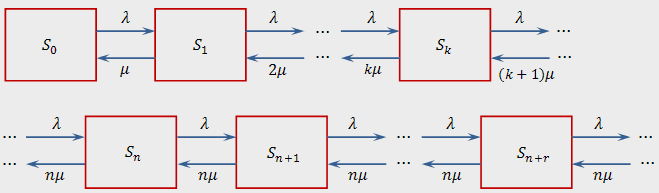

#### Вопрос 07

##### Расчет основных показателей многоканальных СМО с ожиданием.

**Система массового обслуживания**

*Система массового обслуживания (СМО)* — система, которая производит обслуживание поступающих в неё требований.

$\lambda$ - плотность потоков, поступающих в систему заявок;

$\mu$ - интенсивность обслуживания заявок одним каналом;

$T_{пр}$ - время простоя канала;

$T_{об}$ - среднее время обслуживания;

$$
\mu = \frac{1}{T_{об}} \;\;\; \lambda = \frac{1}{T_{пр}}
$$

$\alpha$ - среднее число заявок, приходящее за среднее время обслуживания одной заявки:

$$
\alpha = \frac{\lambda}{\mu}
$$

**СМО с ожиданиями**

Если время пребывания в очереди и число мест в очереди не ограничено, то такая система называется *системой с ожиданием*. 

**Многоканальная СМО с ожиданием**

Формулировка: имеется СМО с неограниченной очередью и $n$ каналами. Поток заявок, поступающих в СМО, имеет интенсивность $\lambda$, а поток обслуживания - интенсивность $\mu$.

Система находится в одном из состояний:
- $S_0$ - в системе нет заявок, все каналы свободны;
- $S_i$ - занято $i$ каналов, остальные свободны; 
- $S_n$ - заняты все $n$ каналов, очереди нет;
- $S_{n+i}$ - заняты все $n$ каналов, в очереди $i$ заявок.

Граф состояний:

Используя формулы для процесса гибели и размножения, можно получить следующие формулы для предельных вероятностей состояний $n$-канальной СМО с неограниченной очередью

$$
p_0 = \left(1+\alpha + \frac{\alpha^2}{2!} + \dotsc + \frac{\alpha^n}{n!} + \frac{\alpha^{n+1}}{n!(n-\alpha)}\right)^{-1} = \frac{1}{\sum_{i=0}^{n} \frac{\alpha^i}{i!} + \frac{\alpha^{n+1}}{n!(n-\alpha)}}
$$

Вероятность, что занято $k$ каналов ($0 \le k \le n$):

$$
p_k = \frac{\frac{\alpha^k}{k!}}{\sum_{i=0}^{n} \frac{\alpha^i}{i!} + \frac{\alpha^{n+1}}{n!(n-\alpha)}}
$$

Вероятность того, что $s$ заявок находится в очереди:

$$
p_{n+s} = \frac{\frac{\alpha^{n+s}}{n!n^s}}{\sum_{i=0}^{n} \frac{\alpha^i}{i!} + \frac{\alpha^{n+1}}{n!(n-\alpha)}}
$$

$$
P_{обсл} = 1
$$

Среднее число занятых каналов:

$$
\overline{k} = \alpha P_{обсл} = \alpha
$$

Среднее число заявок в очереди:

$$
\overline{s} = \frac{\frac{\alpha^{n+1}}{n!n(1-\frac{\alpha}{n})^2}}{\sum_{i=0}^n \frac{2^i}{i!} + \frac{\alpha^{n+1}}{n!(n-\alpha)}}
$$

Среднее время ожидания в системе:

$$
\overline{t}_{ож} = \frac{\overline{s}}{\lambda}
$$

Вероятность наличия очереди:

$$
P_{оч} = 1 - \sum_{i=0}^{n} p_i
$$

Вероятность занятости произвольного канала:

$$
P_{зан} = \frac{\overline{k}}{n}
$$

Среднее время простоя канала:

$$
\overline{t}_{пр} = \frac{1-P_{зан}}{\mu P_{зан}}
$$