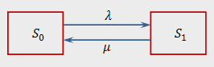

### Блок 1. *Только понятия и основные результаты. без доказательства*

#### Вопрос 01

##### Дискретное вероятностное пространство. События. Теоремы.

1. **Дискретным вероятностным** пространством называется пара из некоторого (не более, чем счетного) множества $Ω$ и функции $p:Ω→R~+~ ( Ω$ называется множеством элементарных исходов , $ω∈Ω$ — элементарным исходом, такая, что $∑_{ω∈Ω}p(ω)=1$.

2. **p** называют дискретной вероятностной мерой , или дискретной плотностью вероятности.

3. Множество $A⊂ΩA⊂Ω$ называется **событием**.

4. **Прямым произведением вероятностных пространств** $X=⟨Ω_1,p_1⟩$ и $Y=⟨Ω_2,p_2⟩$ называется такое вероятностное пространство $Z⟨Ω,p⟩=X×YZ⟨Ω,p⟩=X×Y$, что $Ω=Ω_1×Ω_2, Ω=Ω_1×Ω_2, p(ω_1,ω_2)=p(ω_1)⋅p(ω_2)$.
#### Вопрос 02

##### Произвольное пространство элементарных событий. Алгебры событий

1. **Пространство элементарных событий** — множество всех различных исходов случайного эксперимента.
1. По простому, если кидается кубик и выпадает какая-то грань, то выпадение является элементарным событием, а пространство это тип множество таких выпадений, то есть для кубика оно будет состоять из 6 событий.

#### Вопрос 03

##### Аксиомы теории вероятностей.

1. Каждому событию соответствует определённое число, удовлетворяющее условию $0 \leq P(A) \leq 1$ и называемое его вероятностью.
1. Вероятность достоверного события равна единице.
1. Вероятность невозможного события равна нулю.
1. Вероятность двух несовместных событий равна сумме их вероятностей.

#### Вопрос 04

##### 	Основные теоремы теории вероятностей.

1. Вероятность суммы двух **несовместных** событий равна сумме вероятностей этих событий: $P(A+B)=P(A)+P(B)$.
2. Вероятность суммы двух **совместных** событий равна сумме вероятностей этих событий без вероятности их произведения (совместного осуществления): $P(A+B)=P(A)+P(B)-P(AB)$.
3. Формула полной вероятности: $P(A)=\sum_1^nP(A|B_i)P(B_i)$.
4. Формула Байеса: $P(A|B)=P(B|A)P(A)/P(B)$.
5. Формула Бернулли: $P^k_n=C^k_np^kq^{(n-k)}.$

#### Вопрос 05

##### Условные вероятности. Независимость событий и испытаний.

1. **Условная вероятность** — вероятность наступления события **A** при условии, что событие **B** произошло.
2. Определение Колмогорова: Пусть два события **А** и **В** принадлежат сигма-полю вероятностного пространства и $P(B) >0$. Условная вероятность **A** при условии **B** равняется частному от деления вероятности событий **A** и **B** на вероятность **B**. $P(A|B)=P(A⋂B)/P(B)$.

#### Вопрос 06

##### Случайные величины и функции распределения.

1. Если случайная величина X дискретна, то есть ее распределение однозначно задается функцией вероятности $P(X=x_i)=p_i, i=1, 2,...$, то функция распределения $F_X$ этой случайно величины кусочно-постоянна и может быть записана как:  $F_X =\sum x_i\leq xp_i$.
1. Распределение $P^X$ называется непрерывным, если такова его функция распределения $F_X$. В этом случае: $P(X=x)=0, ∀x ∈ R$, и $F_X(x-0)=F_X(x), ∀x ∈ R$, а следовательно формулы имеют вид: $P(X ∈ |a, b|)=F_X(b)-F_X(a)$, где $|a, b|$ означает любой интервал, открытый или закрытый, конечный или бесконечный.

#### Вопрос 07

##### Числовые характеристики случайных величин и их свойства.

1. **Математическое ожидание** - среднее значение случайной величины. Случайная величина - переменная, значения которой представляют собой численные исходы некоторого случайного феномена или эксперимента. Для дискретной случайной величины: 
   $$
   M(X)=\sum_1^nx_ip_i
   $$

2. **Дисперсия** - мера разброса значений случайной величины относительно её математического ожидания. Формула:
   $$
   D(X)=M(X^2)-M(X)^2
   $$

3. **Ковариация** - мера зависимости двух случайных величин. Формула:
   $$
   cov(X, Y) = M(XY) - M(X)M(Y)
   $$

#### Вопрос 08

##### Независимость случайных величин.

1. Набор случайных величин $ξ_1,...,ξ_n$ называются попарно независимыми в том случае, если любая пара случайных величин независима.

2. Набор случайных величин $ξ_1,...,ξ_n$ называются независимыми в совокупности в том случае, если выполняется условие:
   $$
   P(ξ_1,...,ξ_n)=P(ξ_1)*...*P(ξ_n)
   $$

	По простому, есть кароче 3 события и для них вычисляется вероятность их валидности(одновременно), и полученная вероятность должна быть 		равна перемноженным вероятностям этих событий по отдельности. **Если не понял, то гугли, быдло.** 

### Блок 2. *Некоторые дискретные случайные процессы*

#### Вопрос 01

##### Одномерное случайное блуждание (на числовом луче). Свойства вероятностей.

Одномерное блуждание по лучу 

- есть луч $[0, +\infin) \in N_0$  
- есть *человек*, которая с вероятностью $q$ передвинется на шаг влево, и $p=1-q$ на шаг вправо
- в простейшем случае, *человек* начинает в 0 

**Пример задачи**:

*Условия*: 

Луч $[1, +\infin)$. Человек начинает в 1. Найти вероятность того, что человек *когда нибудь* окажется в 0. 

*Решение*: 

Обозначим $P_i$ - вероятность попасть в 0 из точки *i*, $P_{i, left}$ - означает вероятность попасть в0, если был сделан шаг влево из точки *i*, $q$ - вероятность пойти влево, $p$ - вправо.

По формуле полной вероятности
$$
P_1 = P_{1, left} \cdot q + P_{1, right} \cdot p =1 \cdot q + P_2 \cdot p \;\;\;\; (*)\\
$$
Заметим один факт. Вероятность попасть из точки 2 в точку 1, такая же как вероятность попасть из точки 1 в точку 0 (*вероятность, что когда нибудь мы окажемся левее, чем начинали*). Вероятность попасть из точки 1 в точку 0 нам известно - $P_1$. Чтобы вычислить $P_2$ это событие должно произойти 2 раза, т.е. сначала должен произойти переход из $2 \rightarrow 1$, потом из $1 \rightarrow 0$, т.е. $P_2=P_1 \cdot P_1 = P_1^2$.

Сделаем замену в (*)
$$
P_1 = q + P_1^2 \cdot p \\
P_1^2 \cdot p - P_1 + q = 0 \\
P_1^2 \cdot p - P_1 + 1 - p = 0 \\
P_1 = \frac{1 - p}{p} = \frac{q}{p} \\
P_1 = 1
$$
Решив уравнение получим 2 корня
$$
P_1 = \frac{q}{p} \\
P_1 = 1
$$
Вы можете заметить, что если $q > p$, то $q/p > 1$, что означает, что ответ $P_1 = q/p$ - не подходит, а значит $P_1 = 1$ и не важно насколько $p >>>> q$

*Ответ*: 
$$
\begin{cases}
\frac{q}{p}, q<p\\
1, q\geq p
\end{cases}
$$
Для $P_m$ - случайной точки на луче. Сводится к задаче выше. Нужно вычислить вероятность что из точки $m$ человек когда-нибудь попал в точку $m-1$, потому из $m-1$ в $m-2$, потом из $m-2$ в $m-3$ и тд.
$$
P_m=(P_1)^m=
\begin{cases}
(\frac{q}{p})^m, q<p\\
1, q\geq p
\end{cases}
$$

#### Вопрос 02

##### 	Двумерные и трехмерные случайные блуждания.

*Двумерное случайные блуждания*

При двумерном случайном блуждании на прямоугольной решетке на каждом шаге по времени осуществляется движение случайным образом равновероятно в одном из четырех возможных направлений: на север, юг, восток или запад (4 направления - самый очевидный пример, естественно, направлений может быть сколько угодно, главное, чтобы они были в двумерной плоскости). Движение начинается из точки начала координат *(х=*0; *у =* 0), и может заканчиваться через $M$ шагов в точке $K$ или не заканчиваться вовсе.

*Трехмерное случайное блуждание*

По аналогии с *двумерным* определим *трехмерное случайное блуждание*. При трехмерном случайном блуждании в кубе на каждом шаге по времени осуществляется движение случайным образом равновероятно в одном из шести возможных направлений: на север, юг, восток, запад, вверх или вниз. Точно также движение начинается из начала координат и может иметь заканчиваться через $M$ шагов или не заканчиваться совсем.

#### Вопрос 03

##### Случайные блуждания на отрезке. Задача о разорении.

Блуждание на отрезке - классический пример случайного процесса. Частица начинает движение из точки начала координат ($x = 0$) и с равными вероятностями сдвигается влево или вправо на один шаг. 

Блуждание на отрезке частный случай блуждания на луче. Теперь есть 2 границы: верхняя и нижняя.

Блуждание на отрезке лежит в основе задачи о разорении. 

**Пример задачи:**

*Условия*:

Два игрока играют в игру. Игрок $A$ имеет начальный капитал $a$ монет; игрок $B$ имеет начальный капитал $b$ монет. В каждой партии игрок $A$ выигрывает или проигрывает 1 монету относительно $B$. Блуждание происходит на промежутке $[0; a+b]$. $p$ — вероятность выигрыша в партии игрока $A$, $q$ — вероятность выигрыша в партии игрока $B$. Игра идет до тех пора, пока кто то не обанкротится, т.е у кого нибудь останется капитал 0 монет.

Ответим на следующие вопросы. Какая вероятность что выиграет игрок $A$? Как эта вероятность зависит от $p$ и $q$?

*Решение*:

Обозначим вероятность выиграша первого игрока $P_a$, вероятность проигрыша первого игрока - $Q_a$. Зная решение из задаче о блуждании на луче, можем сделать такое рассуждение. Вероятность что *когда нибудь* первый игрок придет из точки *a* в точку 0 равна 
$$
(\frac{q}{p})^a
$$
Заметим факт, что первый игрок может попасть в точку 0 из точки *a* двумя способами:

- Заходя в точку *a + b* (т.е. сначало он победит)
- Не заходя в точку *a + b* (т.е. сразу проиграет)

Это означает что
$$
(\frac{q}{p})^a = Q_a +P_a \cdot (\frac{p}{q})^{a+b}
$$
*Расшифровка*: игрок сразу проиграл ($Q_a$) или выиграл($P_a$) и попал в $a+b$, а потом все проиграл ($(\frac{p}{q})^a$).
$$
(\frac{q}{p})^a = Q_a +P_a \cdot (\frac{p}{q})^{a+b} \\
(\frac{q}{p})^a = 1-P_a +P_a \cdot (\frac{p}{q})^{a+b} \\
P_a[1 - (\frac{q}{p})^{a+b}]=1-(\frac{q}{p})^{a} \\
P_a=\frac{1-(q/p)^a}{1-(q/p)^{a+b}}
$$
Заметим, что при $q=p=1/2$ применем правило Лапитяля(хи-хи) получим, что 
$$
P_a=\frac{a}{a+b}
$$
  *Ответ*:
$$
\begin{cases}
\frac{a}{a+b}, q=p=1/2 \\
\frac{1-(q/p)^a}{1-(q/p)^{a+b}}, q \neq p
\end{cases}
$$
*Другое решение* (кратко):

Воспользуемы формулой полной вероятности. 
$$
\begin{cases}
P_a=P_{a+1}\cdot p + P_{a-1} \cdot q \\
P_0=0 \\
P_{a+b}=1
\end{cases}
$$
Решив данное уравнение, мы получим тот же самый ответ как и выше.

#### Вопрос 04

##### Задача о выборах.

*Условие:* После выборов, в которых участвуют два кандидата, $A$ и $B$, за них поступило $a$ и $b$ $(a>b)$ бюллетеней соответственно, скажем, 3 и 2. Если подсчёт голосов производится последовательным извлечением бюллетеней из урны, то какова вероятность того, что хотя бы один раз число вынутых бюллетеней, поданных за $A$ и $B$, было одинаково?

**Решение:**

*Сначала приведём решение частного случая*

Возможные последовательности извлечения бюллетеней при $a=3$ и $b=2$:

$AAABB, +AABBA, +ABBAA, +ABABA, +BABAA,$

$+BAABA, +BBAAA, AABAB, +ABAAB, +BAAAB$

Плюсом отмечены комбинации, в которых хотя бы один раз число вынутых бюллетеней за $A$ и за $B$ было одинаковым. В нашем случае искомая вероятность равна $8/10$.

*Общий случай*

Рассмотрим сначала те последовательности, в которых первое равновесное положение достигается в случае, когда подсчитаны $2n$ бюллетеней, $n \leq b$. Каждой последовательности, в которой $A$ лидирует до первого ничейного результата, соответствует единственная последовательность, в которой лидирует $B$. Так, при $n=4$ последовательности $AABABABB$ с лидером $A$ отвечает последовательность $BBABABAA$, в которой лидирует $B$. Эта последовательность получается из первой заменой $A$ на $B$ и $B$ на $A$.

Значит, число последовательностей, в которых $A$ лидирует до первой ничьей, равно числу последовательностей с лидером $B$. Задача сводится к вычислению вероятности равновесного положения, до которого лидирует $B$.

Так как за $A$ подано большее количество голосов, то рано или поздно $A$ становится лидером. Если первый бюллетень подан за $B$, то ничья неизбежна. Единственной возможностью ничьей с $B$, лидирующим в начале, является случай, когда первый бюллетень подан за $B$. Вероятность того, что это так, равна $\frac{b}{a+b}$. Но это же значение равно вероятности ничьей с лидирующим в начале $A$, и, таким образом, вероятность ничейного положения равна $\frac{2 \cdot b}{a+b}$.

**Ответ:** $\frac{2 \cdot b}{a+b}$.

*2-й способ (на основе частного случая)*

Всего последоватльностей: $C_{a+b}^a=\frac{(a+b)!}{a!b!}$;

Подходящих пар: $2\cdot C_{a+b-1}^a=2\cdot \frac{(a+b-1)!}{a!(b-1)!}$;

Искомая вероятность:

$2\cdot \frac{(a+b-1)!}{a!(b-1)!} : \frac{(a+b)!}{a!b!}=\frac{2(a+b-1)!a!b!}{a!(b-1)!(a+b)!}=\frac{2 \cdot b}{a+b}$

#### Вопрос 05

##### Задача о выборе наибольшего приданого (о выборе невесты)

Условие задачи звучит так:

Король, на испытании кандидатов на пост придворного мудреца, предлагает ему женитьбу на молодой придворной даме, имеющей наибольшее приданое. Сумма приданого записывается на билетиках; они перемешиваются. Наудачу вытягивается билетик, и мудрец должен решить, является ли это приданое наибольшим или нет, либо же отказаться от решения.

При правильном решении мудрец побеждает, при неправильном — ничего. При отказе от суммы, указанной на первом билете, мудрец должен вытянуть второй билет и так же принять его или же от него отказаться, пока не сделает выбор или не отвергнет все приданые.

При дворе короля 100 дам, все их приданые различны. Как должен действовать мудрец?

(прим. далее идет решение данной задачи)

Оптимальной стратегией является пропуск первых $s-1$ билетов и выбрать первый максимальный номер после них. Мы выберем максимальное приданое на $і$-м шагу, если вероятность правильного решения при оптимальной стратегии и более позднем вытягивании. Формально: остановится на максимальном номере при $i$-м вытягивании, если
$$
P(выиграть\;при\; i-м\; вытягивании) >\\ P(выиграть\;при\; оптимальной\; стратегии,\; начиная \;с\; i+1\; вытягивания)\;\;(1)
$$
Покажем, что вероятность в правой части (1) убывает, когда $i$ возрастает, а вероятность в левой части (1) возрастает с возрастанием $i$, и после которого предпочтительнее удержать максимальное приданное, нежели продолжать испытание. Вычисляя затем вероятность выигрыша для такой стратегии, найдем оптимальный выбор значения $s$. 

Вероятность того, что на $i$-м максимальное приданное больше всех имеющихся, равна вероятности того, что наилучший номер находится на одном из первых $i$ билетов, а именно равна $\frac{i}{n}$, что является строго возрастающей от $\frac{1}{n}$ до 1 функции от $i$. Поэтому значение $\frac{i}{n}$ в какой-то точке превосходит вероятность выигрыша при продолжении испытании. Сосчитаем вероятность выигрыша для такой стратегии. Вероятность правильного решения есть  вероятность появления ровно одного лидера между  $s$-м шагом и $n$-м. Вероятность того, что наилучший билет появился на $k$-м шагу, равна $\frac{1}{n}$. Вероятность того, что максимум первых $k-1$ номеров появился среди первых $s-1$ номеров, есть $\frac{s-1}{k-1}$. Произведение $\frac{s-1}{n(k-1)}$ дает вероятность того, что выиграем при выборе $k,\;s\leq k\leq n.$ Суммируя эти числа, получим вероятность $\pi(s,n)$ получения наилучшего приданного при оптимальной стратегии
$$
\pi(s,n)=\frac{1}{n}\sum\limits_{k=s}^n\frac{s-1}{k-1}=\frac{s-1}{n}\sum\limits_{k=s-1}^{n-1}\frac{1}{k}=\\
=\frac{s-1}{n}(\frac{1}{s-1}+\frac{1}{s}+\dots+\frac{1}{n-1}),\;1\leq s\leq n.\;\;(2)
$$
 Оптимальное значение $s$ есть такое значение, для которого имеет место неравенство (1), т.е. это наименьшее $s$, для которого 
$$
\frac{s}{n}>\pi(s+1,n)=\frac{s}{n}(\frac{1}{s}+\frac{1}{s+1}+\dots+\frac{1}{n-1})
$$
#### Вопрос 06

##### Математическое ожидание случайных величин, не зависящих от будущего. Марковская случайная величина. Примеры.

**Марковская случайная величина**

Пусть $(\Omega,\mathfrak{F},P)$ - (пространство элементарных событий, алгебра множеств, вероятностная мера). Заданы последовательность независимых случайных величин $\{\xi_n\}^\infty_{n=1}$ и целочисленная случайная величина $\nu \ge 0$. Пусть $\mathfrak{F}_{k,n} = \sigma(\xi_k,\dotsc,\xi_n)$ означает $\sigma$-алгебру, порождённую $n-k+1$ случайными величинами $\xi_k,\dotsc,\xi_n$.

*Определение*. Случайная величина $\nu$ называется *не зависящей от будущего*, если событие $\{\nu \leq n\}$ не зависит от $\mathfrak{F}_{n+1,\infty}$.

*Определение*. Случайная величина $\nu$ называется *марковской*, или *моментом остановки*, если $\{\nu \leq n\} \in \mathfrak{F}_{1,n}$ (То есть знание значений $\xi_1,\dotsc,\xi_n$ позволяет сказать, произошло событие $\{\nu \leq n\}$ или нет).

Марковская случайная величина не зависит от будущего, т.к. она является частью $\mathfrak{F}_{1,n}$, которая не зависит от $\mathfrak{F}_{n+1,\infty}$.

**Пример 1**

Пусть $\nu$ - номер первой случайной величины в последовательсноти $\{\xi_n\}^\infty_{n=1}$, которая оказалась больше или равной $N$, т.е. $\nu=\inf{\{k:\xi_k \ge N\}}$ ($\inf{}$ - инфимум - наибольшая нижняя граница).

Если $\xi_n$ независимы, то, очевидно, $\nu$ не зависит от будущего, т.к. событие $\{\nu \leq n\}=\bigcup_{k=1}^{n}\{\xi_k \ge N\} \in \mathfrak{F}_{1,n}$.

**Пример 2**

Пусть $\xi_k$ - количество брака в $k$-й партии продукции предприятия. Вся продукция бракуется, если при последовательной проверке партий обнаружится, что при некотром $n$ значение суммы $S_n= \sum_{k=1}^{n}\xi_k$ превзошло заданный допустимый уровень $a+bn$. Номер партии $\nu$, при которой это событие произошло: $\nu=\min{\{n:S_n\ge a+bn\}}$. Это момент остановки всей процедуры проверки. Ясно, что $\nu$ удовлетворяет определению марковской величины или момента остановки.

**Математическое ожидание случайных величин, не зависящих от будущего**

Пусть $S_{\nu} = \xi_1+ \dotsc \xi_{\nu}$ - сумма случайного числа случайных величин.

*Теорема Колмогорова-Прохорова*. Пусть целочисленная неотрицательная случайная величина $\nu$ не зависит от будущего. Тогда, если $\sum_{k=1}^{\infty}P(\nu \ge k)M|\xi_k|<\infty$, то $MS_{\nu}=\sum_{k=1}^{\infty}P(\nu \ge k)M\xi_k$.

(*Комментарий с notion*: Матожидание суммы случайного числа слагаемых равно сумме произведений вероятности того, что данное слагаемое входит в сумму, на матожидание этого слагаемого, для всех возможных слагаемых)

#### Вопрос 07

##### Тождество Вальда. Схема цепной реакции.

Пусть $S_{\nu} = \xi_1+ \dotsc \xi_{\nu}$ - сумма случайного числа случайных величин.

**Тождество Вальда**. Если случайные величины $\xi_1,\xi_2,\dotsc$ независимы и одинаково распределены, $M|\xi_k|<\infty$, а случайная величина $\nu$ не зависит от будущего, $M\nu<\infty$, то $MS_{\nu}=M\xi_1M\nu$. (Тождество Вальда является следствием теоремы Колмогорова-Прохорова)

(*Комментарий с notion*: Матожидание суммы случайного числа $\nu$ *одинаковых* случайных величин $\xi$ равно произведению матожидания самой случайной величины $\xi$ на матожидание количества таких случайных величин)

**Схема цепной реакции**

Пусть мы имеем в качестве исходной одну частицу, которая либо исчезает с вероятностью $q$, либо превращается в $m$ таких же частиц с вероятностью $p=1-q$. Каждая частица нового поколения ведёт себя таким же образом независимо от судьбы остальных частиц. Чему равно математическое ожидание числа $\zeta_n$ частиц в $n$-м поколении? ($M\zeta_n - ?$)

Рассмотрим "двойную" последовательность $\{\xi_k^{(n)}\}_{k=1}^{\infty},_{n=1}^{\infty}$ независимых одинаково распределённых случайных величин, принимающих значения $m$ и 0 с вероятностями $p$ и $q$. Очевидно, что последовательности $\{\xi_k^{(1)}\}_{k=1}^{\infty},\{\xi_k^{(2)}\}_{k=2}^{\infty},\dotsc$ будут независимыми между собой. С помощью этих последовательностей случайные величины $\zeta_n(\zeta_0=1)$ можно представить в виде:

$$\zeta_1=\xi_{\zeta_0}^{(1)}=\xi_1^{(1)}$$

$$\zeta_2=\xi_1^{(2)}+\dotsc+\xi_{\zeta_1}^{(2)}$$

$$\dotsb$$

$$\zeta_n=\xi_1^{(n)}+\dotsc+\xi_{\zeta_{n-1}}^{(n)}$$

$\zeta_i$ - количество частиц в $i$-м поколении. В равенстве для $\zeta_n$ число слагаемых $\zeta_{n-1}$ есть число "частиц-родителей". Т.к. последовательность $\{\xi_k^{(n)}\}$ не зависит от $\zeta_{n-1}$ и $M\xi_k^{(n)}=pm$, то в силу тождества Вальда 

$$M\zeta_n=M\xi_1^{(n)}M\zeta_{n-1}=pmM\zeta_{n-1}=(pm)^n$$

*(Чуть более подробный вывод формулы из notion)*

$M|\xi_k^{(\cdot)}|<\infty$

$M\xi_k^{(\cdot)}=0\cdot q + m\cdot p=mp<\infty$ - матожидание каждой из случайных величин($M\xi_n$ в тождестве Вальда)

$M\zeta_1=mp<\infty$

$M\zeta_1=mp\cdot mp=(mp)^2<\infty$(количество случайных величин ($\nu$ в тождестве Вальда) равно $\zeta_1$)

$M\zeta_3 = M(\xi_1^{(3)} +\dotsc+ \xi_{\zeta_2}^{(3)})= M\xi_k^{(3)}\cdot M\zeta_2 = mp\cdot (mp)^2 = (mp)^3$

$\dotsc$

$M\zeta_n = (mp)^n$

#### Вопрос 08

##### Решение задачи о разорении

*Условие*: В игре участвуют 2 игрока. Начальный капитал первого игрока равен $z_1>0$, второго игрока - $z_2>0$. Каждую партию игрок выигрывает или проигрывает с вероятностью 1/2 независимо от исходов предыдущих партий, при этом его капитал соответственно увеличивается или уменьшается на единицу. Игроки состязаются до банкротства одного из них. Какова вероятность выигрыша для одного из них? *(Капиталы обоих игроков конечны)*

*Решение*: Введём случайные величины $\xi_k$, изображающие выигрыш первого игрока в $k$-й партии. Очевидно, что $\xi_k$ независимы,

$$\xi_k=
    \begin{cases}
        1 &\text{с вероятностью 1/2}\\
        -1 &\text{с вероятностью 1/2}       
    \end{cases}$$

Число $z_1+S_k=z_1+\sum_{j=1}^k{\xi_j}$ будет означать капитал первого игрока, а $z_2-S_k$ - капитал второго игрока после $k$ партий. Величина

$$\eta=\min{\{k:z_1+S_k=0 \text{ или } z_2-S_k\}}$$

есть время до окончания игры, т.е. до разорения одного из игроков. Спрашивается, чему равна вероятность $P_i$ того, что выигрыает $i$-й игрок($i=1,2$)?

Ясно, что $\eta$ есть марковский момент, при этом $S_{\eta}=-z_1$ с вероятностью $P_2$ и $S_{\eta}=z_2$ с вероятностью $P_1=1-P_2$. Поэтому 

$$MS_{\eta}=P_1z_2-P_2z_1$$

Если $M\eta<\infty$, то в силу тождества Вальда мы имели бы 

$$P_1z_2-P_2z_1=M\eta M\xi_1=0$$

Отсюда находим, что $P_i=z_i/(z_1+z_2)$.

Остаётся проверить конечность $M\eta$. Пусть для простоты $z_1+z_2=2z$ - чётно. С вероятностью $2^{-\min{(z_1,z_2)}}\ge 2^{-z}$ игра может закончиться за $\min{(z_1,z_2)} \le z$ партий. Так как в течение игры суммарный капитал обоих игроков не меняется, то

$$P(\eta>z)\le1-2^{-z},\dotsc,P(\eta>zN)<(1-2^{-z})^N$$

Это, очевидно, влечёт за собой конечность

$$M\eta=\sum_{k=0}^{\infty}P(\eta>k)$$

*Комментарий*: существует ещё как минимум 2 варианта решения данной задачи: аналитический(случайное блуждание на отрезке с поглощением) и на марковских цепях. В вопросе приведено решение через процессы, не зависящие от будущего, так как оно приведено в учебнике Боровкова сразу после разбора двух предыдущих вопросов.

#### Вопрос 09

##### Ветвящиеся процессы. Вероятность вырождения.

Если случайная величина $\xi$ целочисленна, т.е. $P(\bigcup_k\{\xi=k\})=1$, то распределение можно характеризовать *производящей функцией*

$$\psi_{\xi}(z)=Mz^{\xi}=\sum z^kP(\xi=k)$$

**Ветвящиеся процессы**

Представим себе частицы, которые могут производить другие частицы того же вида. Пусть в начальный момент времени имеется одна частица ("нулевое поколение"), которая в результате акта "деления" с вероятностью $f_k, k=0,1,2,\dotsc$, переходит в $k$ частиц того же типа, $\sum_{k=0}^{\infty}f_k=1$. Полученные частицы образуют "первое поколение". Каждая из частиц этого поколения ведёт себя точно так же, как исходная частица, независимо от предыстории и судьбы других частиц. В результате получаем нулевое поколение и т.д.

Обозначим $\zeta_n$ число частиц в $n$-м поколении. Для описания последвательности $\zeta_n$ введём в рассмотрение независимые между собой последовательности независимых одинаково распределённых случайных величин $\{\xi_j^{(1)}\}_{j=1}^{\infty},\{\xi_j^{(2)}\}_{j=1}^{\infty},\dotsc$, где $\xi_j^{(n)}$ имеют распределение 

$$P(\xi_j^{(n)}=k)=f_k, k=0,1,\dotsc$$

Тогда последовательность $\zeta_n$ можно представить в виде

$$\zeta_0=1,$$

$$\zeta_1=\xi_1^{(1)},$$

$$\zeta_2=\xi_1^{(2)}+\dotsc+\xi_{\zeta_1}^{(2)},$$

$$\dotsb$$

$$\zeta_n=\xi_1^{(n)}+\dotsc+\xi_{\zeta_n-1}^{(n)}.$$

Это есть сумма случайного числа случайных величин. Т.к. $\xi_1^{(n)},\xi_2^{(n)},\dotsc$ от $\zeta_{n-1}$ не зависят, то по формуле полной вероятности для производящей функции $f_{(n)}(z)=Mz^{\zeta_n}$ получим

$$f_{(z)}(z)=\sum_{k=0}^{\infty}P(\zeta_{n-1}=k)Mz^{\xi_1^{(n)}+\dotsc+\xi_k^{(n)}}=\sum_{k=0}^{\infty}P(\zeta_{n-1}=k)f^k(z)=f_{n-1}(f(z)),$$

где $f(z)=f_{(1)}(z)=Mz^{\xi-1^{(n)}}=\sum_{k=0}^{\infty}f_kz^k$. Пусть $f_n(z)$ означает $n$-ю итерацию функции $f(z)$, т.е. $f_1(z)=f(z), f_2(z)=f(f(z)), f_3(z)=f(f_2(z))$ и т.д. Тогда с помощью инфдукции из соотношений заключаем, что производящая функция $\zeta_n$ равна $n$-й итерации $f(z)$:

$$Mz^{\zeta_n}=f_n(z)$$

Отсюда с помощью дифференцирования в точке $z=1$ легко получить рекуррентные соотношения для моментов $\zeta_n$.

**Вырождение процесса**

Как найти вероятность вырождения процесса? *Вырождение* - событие, состоящее в том, что все $\zeta_n$, начиная с некоторого $n$, равны 0. (Если $\zeta_n=0$, то, очевидно, $\zeta_{n+1}=\zeta_{n+2}=\dotsc=0$, т.к. ($\zeta_{n+1}=0/ \zeta_{n} = 0)=1$.) Обозначим $A_k=\{\zeta_k=0\}$. Тогда вырождение представляет собой событие $\bigcup_{k=1}^{\infty}A_k$. Т.к. $A_n\subset A_{n+1}$, то вероятность вырождения $q$ равна $q=\lim_{n\to \infty} P(A_n)$.

*Теорема*. Вероятность вырождения $q$ равна наименьшему неотрицательному корню уравнения $q=f(q)$.

### Раздел 3. *Флуктуации при бросании монеты. Случайные блуждания*

#### Вопрос 1

##### Основные понятия: путь. Число путей из начала в точку (n.x). Постановка задачи о баллотировке, ранговый критерий Гальтона, связь случайного блуждания с результатами бросания правильной монеты.

Определение. Пусть $x>0$ и $y$ - целые числа. *Путем* $\{s_1, s_2, \dots, s_x\}$ из начала координат в $(x,y)$ называется ломанная с вершинами, которые имеют абсциссы $0,1,2,\dots, x$ и ординаты $s_0, s_1, \dots, s_x$, удовлетворяющие условиям 
$$
s_i-s_{i-1}=\varepsilon_i=\pm1,\;s_0=0\;(i=1,2,\dots,x)
$$
 и такие, что $s_x=y$.

Произвольная точка $(x,y)$ может быть соединены путем с началом координат тогда и тогда и только тогда, когда $x$ и $y$ имеют вид 
$$
x=p+q,\;\;\;y=p-q\;\;\;(*)
$$
где $p,q\in N_0, p>q$. В этом случае $p$ положительных $\varepsilon_i$ можно разместить на $x=p+q$ возможных местах
$$
N_{x,y}=\begin{pmatrix}
p+q\\
p
\end{pmatrix}=\begin{pmatrix}
p+q\\
q
\end{pmatrix}
$$
различными способами. 

Удобно доопределишь $N_{x,y} = 0$, если $x$ и $y$ не имеют  форму (*). Тогда существует ровно $N_{x,y}$ различных путей из начала координат в точку $(х, у)$. Лемма Бертрана устанавливает, что при $y  0$ существует $(y/x)N_{x,y}$ путей, удовлетворяющих условиям $s_1>0, s_2>0,\dots,s_{x-1}>0, s_x=y$. 

**Задача о баллотировке** 

Классическое определение задачи о баллотировке звучит следующим образом "Какова вероятность того, что на выборах с участием двух кандидатов, в которых первый набрал $p$ голосов, а второй набрал $q<p$, первый будет опережать второго в течение всего времени подсчета голосов?" 

Если рассматривать числа $\{s_1,\dots,s_n\}$ - результаты голосования в каждый момент времени, то можно получить $2^n$ путей. эти $2^n$ путей можно использовать для представления $2^n$ возможных исходов $n$ последовательных бросаний правильной монеты. В класси­ческом изложении вводится воображаемый игрок Петр, который при каждом испытании выигрывает или теряет один рубль. Числа $\{s_1,\dots,s_n\}$ представляют тогда последовательные чистые
выигрыши Петра, т. е. разности между полным числом гербов и решеток.

**Ранговый критерий Гальтона** 

Предположим, что некоторая величина (например, высота растения) измеряется у каждого из $r$ подвергнутых воздействию объектов и также у каждого из $r$ контрольных объектов. Обозначим результаты измерений $a_1,\dots, a_r$ и $b_1,\dots, b_r$ соответственно. Для ясности предположим, что каждая группа упорядочена по убыванию: $a_1>a2>...$ и $b_1>b_2>...$ Объединим теперь эти две последовательности в одну с числом элементов $n=2r$ и упорядоченную по убыванию. Предшествование всех значений $a$ всем значениям $b$ указывает на весьма высокую эффективность воздействия, тогда как случайная комбинация значений $a$ и $b$ означает полную его бесполезность. Таким образом, об эффективности воздействия можно судить на основании различных значений $a$, предшествующих соответствующим $b$, т.е. на основании числа индексов $k$, для которых $a_k>b_k$.

#### Вопрос 2

##### Принцип отражения . Теорема о баллотировке.

*Лемма (принцип отражения).* Число путей из $A$ в $B$, которые касаются или пересекают ось $x$, равно числу всех путей из $A'$ в $B$. 

*Теорема о баллотировке.* Пусть $x>0,\;y>0$, число путей $\{s_1,\dots,s_x=y\}$ из числа координат в точку $(x,y)$, таких, что $s_1>0, \dots, s_x>0$ равно $(y/x)N_{x,y}.$ 

#### Вопрос 3

##### Случайные блуждания. Вычисление вероятностей $p_{n,r}, u_{2n}, f_{2n}$

Производится $N$ бросаний правильной монеты. При этом $\varepsilon_k = \pm 1$ при победе или поражении соответственно. Тогда $s_k = \sum\limits_{i=1}^k\varepsilon_i$ - разность между числом гербов и решек после каждого $k$-го броска. Каждый возможный исход $N$ бросаний правильной монеты можно интерпретировать как некоторый путь из начала координат. 

Очевидно, в случае $k+1$ броска монеты, событие, зависящее от исхода первых $k$ испытаний, имеет вероятность, которая не зависит от $N$. 

Для отслеживания текущего состояния удобно ввести частицу, которая в одинаковые моменты времени будет двигаться вверх или вниз в зависимости от того, какая сторона монеты выпала. 

Мы будем говорить, что частица совершает симметрическое случайное блуждание. 

Для случайных блужданий переопределены следующие величины
$$
u_{2n}=\begin{pmatrix}
2n\\
n
\end{pmatrix}2^{-2n},\;\;\; n=0,1,2,\dots
$$

$$
f_{2n}=u_{2n-2}-u_{2n},\;\;\; n=0,1,2,\dots
$$

$$
p_{2k,2n}=u_{2k}u_{2n-2k}
$$

где $u_{2n}$ - вероятность того, что в течении всего времени от 0 до $2n$ частица находится на положительной стороне; $f_{2n}$ - вероятность вернуться в начало координат; $p_{2k, 2n}$ - вероятность того, что в интервале времени от 0 до $2n$ частица проводит $2k$ единиц времени на положительной стороне.

#### Вопрос 04

##### Основная лемма. Две формулировки.

Для любого $n \ge 1$

$$
u_{2n} = P \{s_{2n} = 0\}
$$

$$
u_{2n} = P \{s_1 \ne 0, s_2 \ne 0, \dots, s_{2n} \ne 0\}
$$

$$
u_{2n} = P \{s_1 \ge 0, s_2 \ge 0, \dots, s_{2n} \ge 0\}
$$

или словами: следующие три события имеют одну и ту же вероятность $u_{2n}$:

- В момент времени $2n$ имет место возвращение в начало координат;
- До момента $2n$ (включительно) частица ни разу не возвратилась в начало координат;
- Путь неотрицателен в интервале времени между 0 и $2n$.

Далее,

$$
f_{2n} = P \{s_1 \ne 0, \dots , s_{2n-1} \ne 0, s_{2n} = 0\}
$$

$$
f_{2n} = P \{s_1 \ge 0, \dots , s_{2n-2} \ge 0, s_{2n-1} < 0\}
$$

т.е. два события имеют одну и ту же вероятность $f_{2n}$:

- Первое возвращение в начало координат произошло в момент $2n$;
- Частица впервые достигла точку $-1$ в момент $2n-1$.

(Примечание)

$$
u_{2n} = \binom{2n}{n} 2^{-2n}, \;\;\; n=0,1,2,\dots
$$

$$
f_0 = 0, \; f_{2n} = \frac{1}{2n} u_{2n-2}, \;\;\; n=1,2,\dots
$$

$$
f_{2n} = u_{2n-2} - u_{2n}, \;\;\; n=1,2,\dots
$$

#### Вопрос 5

##### Последнее попадание. Закон арксинуса для последних попаданий.

С точки зрения интуиции кажется, что за достаточно долгое время $2n$ в игре двух игроков число ничьих (т.е. моментов, когда суммарный выигрыш у обоих игроков одинаков) должно быть пропорционально $2n$, однако это не так. 

Число ничьих возрастает по вероятности как $(2n)^{1/2}$, т.е. с увеличением продолжительности игры число ничьих падает. 

*Теорема*

Вероятность того, что путь длины $2n$ имеет первый максимум в точке $x=\nu$ равна
$$
\frac{1}{2}u_{2k}u_{2n-2k},\;\;\begin{matrix}
если\; \nu=2k\;(k=1,2,
dots,n)\\
или\; \nu=2k+1\;(k=1,2,
dots,n-1)
\end{matrix}
$$
и $u_0$, если $\nu=0$

Вероятность получить первый максимум в точках $2k$ или $2k+1$ равна вероятности $p_{2k,2n}$. Отсюда вытекает, что применима приближенная формула закона арксинуса и, значит, существует сильная тенденция к расположению максимумов вблизи начальной или конечной точке пути.

*Теорема (Первый закон арксинуса)*

При фиксированном $\alpha\;(0<\alpha<1)$ и $n\rightarrow\infty$ вероятность того, что доля $k/n$ времени, проведенного частицей на положительной стороне, меньше $\alpha$, стремится к
$$
\pi^{-1}\int\limits_{1/2}^{\alpha}\frac{dx}{\{x(1-x)\}^{1/2}}=2\pi^{-1}arcsin\,\alpha^{1/2}
$$
#### Вопрос 06

##### Закон дискретного арксинуса для времени пребывания.

**Теорема.** Пусть $p_{2k, 2n}$ - вероятность того, что в интервале времени от 0 до $2n$ частица проводит $2k$ единиц времени на положительной стороне и $2n-2k$ на отрицательной стороне. Тогда
$$
p_{2k,2n} = u_{2k} u_{2n-2k}
$$
(Полное время, проведенное на положительной стороне, обязательно четно).
#### Вопрос 07

##### Максимумы и первые достижения.

Пусть $x=r>0$ - некоторая прямая. $S_0 = 0$, $S_n = k$. Начало в т.$O(0,0)$, конец в т.$A(n,k)$.

Рассмотрим путь из $O$ в $A$, который касается или пересекает прямую $x=r$. Для нахождения числа таких путей применим лемму об отражении. Число таких путей равно числу всех путей из отраженной относительно $x=r$ точки $(0,0)$ (т.е. точки $(0,2r)$) в точку $A$:
$$
N=\mathcal{N}_{n, 2r-k}
$$
**Лемма.** Пусть $k \le r$. Вероятность того, что путь длины $n$ ведёт в т.$A(n,k)$ и имеет максимум $\ge r$, равна
$$
p_{n,2r-k} = \frac{\mathcal{N}_{n, 2r-k}}{2^n}
$$
Для нахождения вероятности того, что максимум *равен* $r$, необходимо отнять от числа ломаных, касающихся или пересекающих $x=r$, число ломаных, касающихся или пересекающих $x=r+1$:
$$
p_{max=r} = \frac{\mathcal{N}_{n, 2r-k} - \mathcal{N}_{n, 2(r+1)-k}}{2^n}
$$
**Теорема.** Вероятность того, что первое достижение $r$ произошло в момент времени $n$ равна
$$
\varphi_{r,n} = \frac{1}{2} (p_{n-1,r-1} - p_{n-1,r+1}) = \frac{r}{n} \binom{n}{\frac{n+r}{2}} 2^{-n}
$$
#### Вопрос 8

##### Двойственные случайные блуждания. Получение новых вероятностных соотношений для двойственных блужданий.

Выходя из начала координат (0;0), частица с равной вероятностью сдвигается на один шаг либо на юг, либо на север, и одновременно (и тоже с равной вероятностью) на один шаг либо на восток, либо на запад. После того как шаг сделан, движение продолжается аналогичным образом из нового положения и так далее до бесконечности. Какова вероятность того, что частица когда-нибудь вернется в начало координат?

Прежде всего, сколько раз частица вернется в начало? Вероятность ровно x возвращений есть $P^xQ$, так как после каждого возвращения частицу можно рассматривать как снова выходящую из начала. Если бы $P$ было известно, то среднее число возвращений в начало координат можно было бы найти, суммируя геометрический ряд вида $u = \sum\limits_{x=1}^{\infty}xP^xQ$.  

Выходя из начала, частица может попасть в него обратно лишь после четного числа шагов. Более того, ее путь может быть представлен как «произведение» двух независимых одномерных случайных блужданий, каждое из которых начинается в начале координат, и одно происходит в вертикальном направлении, а другое - в горизонтальном направлении. После двух шагов горизонтальная компонента x имеет распределение

После $2n$ шагов вероятность того, что частица вернулась в начало координат равняется 
$$
p_{2n}=\left[\begin{pmatrix}
2n\\
n
\end{pmatrix}\cdot
\left(\frac{1}{2}\right)^{2n}\right]^2
$$
так как для осуществления этого события мы должны иметь равные количества шагов как по вертикали, так и по горизонтали.

Просуммируем теперь приближенные выражения для этих вероятностей и найдем математическое ожидание числа возвращений. Для больших значений n можно применить формулу Стирлинга, и получить
$$
\begin{pmatrix}
2n\\
n
\end{pmatrix}\cdot
\left(\frac{1}{2}\right)^{2n}=\frac{(2n)!}{n!\cdot n!}\cdot\left(\frac{1}{2}\right)^{2n}\approx\frac{\sqrt{2\pi}\cdot(2n)^{2n+1/2}\cdot e^{-2n}}{\left(\sqrt{2\pi}\cdot n^{n+1/2}\cdot e^{-n}\right)\cdot 2^{2n}} \approx \frac{1}{\sqrt{\pi n}}
$$
#### Вопрос 09

##### Различные подходы к решению задачи о разорении.

*(Прим. Решение взято с notion)*

*Условие*. Два игрока играют в безобидную игру (вероятность выиграть и проиграть равна 1/2). Начальный капитал игрока $A$ равен $a$, игрока $B$ - $b$. В каждой партии игрок $A$ выигрывает или проигрывает 1 монету относително $b$. $p$ - вероятность выигрыша $A$, $q$ - вероятность выигрыша $B$. Найти вероятность разорения игроков.

**4 подхода к решению задачи о разорении**

- Графический;
- Аналитический (случайное блуждание на отрезке с поглощением);
- На марковских цепях;
- Через процессы, не зависящие от будущего.

Далее подробнее о каждом из них.

**Графический способ.**

$$
\xi_i = \begin{cases}
        1, & p(1) = 1/2\\
        -1, & p(-1) = 1/2
        \end{cases}
$$

$S_n = \xi_1 + \dots + \xi_n + a$ - капитал игрока $A$ после $n$ партий.

Разорение происходит, если $x=0$ или $x=a+b$.

**Аналитический (случайное блуждание на отрезке с поглощением).**

Обозначим $Q_x$ - вероятность попадания из $x$ в 0. Рассмотрим случай для небезобидной игры, где $q$ - вероятность проигрыша, $p$ - вероятность выигрыша.

$$
Q_1 = \begin{cases}
        \frac{q}{p}, & q < p\\
        1, & q \ge p
        \end{cases}
$$

$$
Q_a = \begin{cases}
        (\frac{q}{p})^a , & p > \frac{1}{2}\\
        1, & p \le \frac{1}{2}
      \end{cases}
$$

$Q_a$ - вероятность попасть в начало из точки $x=a$.

$Q_a = P_1(\text{попасть в начало, не доходя до } x=a+b) + P(\text{дойти до } x=a+b) \cdot P(\text{попасть в начало из точки } x=a+b)$. $P_1$ - вероятность разорения игрока $A$.

$$
P_1 = \frac{(\frac{q}{p})^a - (\frac{q}{p})^{a+b}}{1-(\frac{q}{p})^{a+b}}
$$

При безобидной игре получаем неопределенность и с помощью пределов получим следующее:

$P_1 = \lim_{x \to 1} \frac{x^a-x^{a+b}}{1-x^{a+b}} = \frac{b}{a+b}$

**На марковских цепях.**

Пусть для примера начальные капиталы игроков равны $a=2$, $b=3$. $X_i = i$, $i \in \overline{0,5}$. 

Если $i \ne 0$, $i \ne 5$, то $P(X_i \rightarrow X_{i+1}) = 1/2 = P(X_i \rightarrow X_{i-1})$. 

При $i=0$ $P(X_0 \rightarrow X_i) = 0$, $P(X_0 \rightarrow X_0) = 1$. 

При $i=5$ $P(X_5 \rightarrow X_i) = 0$, $P(X_5 \rightarrow X_5) = 1$.

Это блуждание представляет собой цепь Маркова из 6 состояний и матрицей перехода

$$
\pi = \begin{pmatrix}
        1&0&0&0&0&0\\
        1/2&0&1/2&0&0&0\\
        0&1/2&0&1/2&0&0\\
        0&0&1/2&0&1/2&0\\
        0&0&0&1/2&0&1/2\\
        0&0&0&0&0&1
      \end{pmatrix}
$$

**Через процессы, не зависящие от будущего**

Введём случайные величины $\xi_k$, изображающие выигрыш первого игрока в $k$-й партии.

$$\xi_k=
    \begin{cases}
        1 &\text{с вероятностью 1/2}\\
        -1 &\text{с вероятностью 1/2}
    \end{cases}$$

Число $a+S_k=a+\sum_{j=1}^k{\xi_j}$ будет означать капитал первого игрока, а $b-S_k$ - капитал второго игрока после $k$ партий. Величина

$$\eta=\min{\{k:a+S_k=0 \text{ или } b-S_k\}}$$

есть время до окончания игры, т.е. до разорения одного из игроков. Спрашивается, чему равна вероятность $P_i$ того, что выигрыает $i$-й игрок($i=1,2$)?

Ясно, что $\eta$ есть марковский момент, при этом $S_{\eta}=-a$ с вероятностью $P_2$ и $S_{\eta}=b$ с вероятностью $P_1=1-P_2$. Поэтому 

$$MS_{\eta}=P_1 b-P_2 a$$

Если $M\eta<\infty$, то в силу тождества Вальда мы имели бы 

$$P_1b-P_2a=M\eta M\xi_1=0$$

Отсюда находим, что $P_1=a/(a+b)$, $P_2=b/(a+b)$.

Остаётся проверить конечность $M\eta$. Пусть для простоты $a+b=2z$ - чётно. С вероятностью $2^{-\min{(a,b)}}\ge 2^{-z}$ игра может закончиться за $\min{(a,b)} \le z$ партий. Так как в течение игры суммарный капитал обоих игроков не меняется, то

$$P(\eta>z)\le1-2^{-z},\dotsc,P(\eta>zN)<(1-2^{-z})^N$$

Это, очевидно, влечёт за собой конечность

$$M\eta=\sum_{k=0}^{\infty}P(\eta>k)$$
### Блок 4. *Цепи Маркова*

#### Вопрос 1

##### Определения. Примеры. Матрица перехода

Определение 1. 

​	Последовательность $\{X_n \}_0^\infty$ образует цепь Маркова, если $P(X_n = j | X_0 = k_0,X_1 = k_1,\ldots, X_{n-2} = k_{n-2},X_{n-1 = i}) = P(X_n=j|X_{n-1} = i) = p_{ij}^{(n)}$. 

Таким образом, цепь Маркова можно представить себе как некоторую систему с возможными состояниями {$E_1,E_2,\ldots,$}. Главное свойство марковских цепей: при фиксированном настоящем будущее и прошлое последовательности {$X_n$} независимы.

​	Определение 2.

​	Марковская цепь $\{X_n \}_0^\infty$ называется однородной, если вероятности $p_{ij}^{(n)}$ не зависят от n. То есть вероятность перехода из $E_i$ в $E_j$ одинакова в любой момент времени.

Определение 3.

​	Состояние $E_i$ называют несущественным, если существует такое состояние $E_j$ и целое $t_0 > 0$, что $p_{ij}(t_0) > 0, p_{ji}(t) = 0$ для любого целого t. То есть попасть в состояние можно, но вернуться из него обратно - нет. В противном случае - состояние существенное.

Существенные состояние $E_i$ и $E_j$ называются сообщающимися, если существуют такие целые числа $t>0$ и $s > 0$, что $p_{ij}(t) > 0$ и $p_{ji}(s) > 0$. То есть из одного состояния можно прийти в другое, а из другого - в первое.

Определение 4

​	Цепь Маркова, состоящая из одного класса существенных, сообщающихся состояний, называется неразложимой (неприводимой). Если цепь содержит более одного такого класса, то разложимой.

​	Матрица переходных вероятностей

$\begin{pmatrix} P_{11} & P_{12} & \ldots & P_{1n} \\ P_{21} & P_{22} & \ldots & P_{2n} \\ \ldots &\ldots & \ldots & \ldots \\ P_{n1} & P_{n2} & \ldots & P_{nn} \end{pmatrix}$ ​, где $P_{ij}$ - вероятность перехода напрямую из состояния $i$ в $j$.

Сумма по строке всегда должна быть равна единице, а по столбу - необязательно.

Пример 1. Блуждание с поглощением и отражением.

Пусть $a > 0$ - целое число. Рассмотрим блужданием частицы по целым точкам между 0 и $а$. Если $0 < k < a$, то из точки $k$ с вероятностями 1/2 частица переходит в $k-1$ или $k+1$. Если $k$ равно 0 или $a$, то частица остается в точке $k$ с вероятностью 1. Это так называется блуждание с поглощением. Если $X_n$ - случайная величина, равная координате частицы в момент $n$, то последовательность {$X_n$} образует цепь Маркова, так как условное распределение случайной величины $X_n$ зависит только от значения $X_{n-1}$. Легко увидеть, что эта цепь однородна.

​	Если же частица из точки 0 с вероятностью 1 переходит в точку 1, а из точки $a$ с вероятностью 1 в точку $a_1$, то получим блуждание с отражением. Ясно, что и в этом случае положения частицы $X_n$ будут связаны в однородную цепь Маркова.  

#### Вопрос 2

##### Блуждания с поглощением и отражением. Классификация состояний. Классы состояний

Определение 1.

​	Состояние $E_i$ называют несущественным, если существует такое состояние $E_j$ и целое $t_0 > 0$, что $p_{ij}(t_0) > 0, p_{ji}(t) = 0$ для любого целого t. То есть попасть в состояние можно, но вернуться из него обратно - нет. В противном случае - состояние существенное.

Существенные состояние $E_i$ и $E_j$ называются сообщающимися, если существуют такие целые числа $t>0$ и $s > 0$, что $p_{ij}(t) > 0$ и $p_{ji}(s) > 0$. То есть из одного состояния можно прийти в другое, а из другого - в первое.

Определение 2.

​	Состояние $E_j$ называется возвратным, если $F_j$ = 1, и невозвратным, если $F_j$ < 1. где $F_j = \sum \limits_{n=1}^\infty f_j(n)$, где $f_j(n) = P(X_n=j,X_{n-1} \neq j,\ldots,X_1 \neq j|X_0=j)$  

​	Состояние $E_j$ называется нулевым, если $p_{jj}(n) \rightarrow 0$ при $n \rightarrow \infty$, и ненулевым в противном случае.

​	Состояние $E_j$ называется периодическим с периодом $d_j$, если возвращение с положительной вероятностью в $E_j$ возможно только за число шагов, кратное $d_j > 1$ и $d_j$ есть наибольшее число, обладающее этим свойством.

Блуждание с поглощением и отражением.

Пусть $a > 0$ - целое число. Рассмотрим блужданием частицы по целым точкам между 0 и $а$. Если $0 < k < a$, то из точки $k$ с вероятностями 1/2 частица переходит в $k-1$ или $k+1$. Если $k$ равно 0 или $a$, то частица остается в точке $k$ с вероятностью 1. Это так называется блуждание с поглощением. Если $X_n$ - случайная величина, равная координате частицы в момент $n$, то последовательность {$X_n$} образует цепь Маркова, так как условное распределение случайной величины $X_n$ зависит только от значения $X_{n-1}$. Легко увидеть, что эта цепь однородна.

​	Если же частица из точки 0 с вероятностью 1 переходит в точку 1, а из точки $a$ с вероятностью 1 в точку $a_1$, то получим блуждание с отражением. Ясно, что и в этом случае положения частицы $X_n$ будут связаны в однородную цепь Маркова.  

#### Вопрос 3

##### Теорема о возвратности состояний. Теорема солидарности (без доказательства)

Определение 1.

​	Состояние $E_j$ называется возвратным, если $F_j$ = 1, и невозвратным, если $F_j$ < 1, где $F_j = \sum \limits_{n=1}^\infty f_j(n)$, где $f_j(n) = P(X_n=j,X_{n-1} \neq j,\ldots,X_1 \neq j|X_0=j)$  

​	Состояние $E_j$ называется нулевым, если $p_{jj}(n) \rightarrow 0$ при $n \rightarrow \infty$, и ненулевым в противном случае.

​	Состояние $E_j$ называется периодическим с периодом $d_j$, если возвращение с положительной вероятностью в $E_j$ возможно только за число шагов, кратное $d_j > 1$ и $d_j$ есть наибольшее число, обладающее этим свойством.

Теорема 1. Состояние $E_j$ возвратно тогда и только тогда, когда $P_j = \sum \limits_{n=1}^\infty p_{ij}(n) = \infty$. Для невозвратного $E_j$: $F_j = \frac{P_j}{1+P_j}$.

Следствие 1. Невозвратное состояние всегда является нулевым.

Разница между свойствами "нулевое" и "невозвратное": у невозвратного состояния вероятность вернуться $\in[0;1)$, а у нулевого строго равна 0; в нулевое состояние при малом количестве шагов можно вернуться, но при большом количестве шагов эта вероятность становится ничтожно малой. 

Теорема 2 (теорема солидарности). В неразложимой цепи Маркова все состояния принадлежат одному типу: если хоть одно возвратно, то и все возвратны: если хоть одно нулевое, то и все нулевые; если хоть одно периодично с периодом $d$, то и все периодичны с периодом $d$

#### Вопрос 4

##### Стационарное распределение. Эргодическая теорема (без доказательства). Примеры вычисления стационарных вероятностей.

Теорема 8 (Эргодическая). 

(1) Существует состояние $E_s$ такое, что время $\tau^{(s)}$ возвращения в $E_s (P(\tau^{(s)}= n) = f_s(n))$ имеет конечное математическое ожидание $E\tau^{(s)} < \infty$.

(2) Цепь неразложима

(3) Цепь непериодична

Условия (1-3) необходимы и достаточны для того, чтобы при любых $i$ и $j$ существовали не зависящие от $i$ положительные пределы $\lim\limits_{n\rightarrow\infty} p_{ij}(n) = \pi_j >0, i,j =0,1,2,\ldots$

Числа $\{\pi_j \}$ являются единственным в классе последовательностей, образующих абсолютно сходящиеся ряды, решением системы уравнений: $\begin{cases} \sum \limits_{j=0}^∞ \pi_j=1 \\ \pi_j=\sum \limits_{k=0}^∞\pi_k p_{kj};\;j=0,1,2...\end{cases}$(2)

Кроме того, $E_{t^{(s)}}<∞$ при всех $j$ и числа $\pi_j=(Et^{(j)})^{-1}$ допускают представление $\pi_j=(Et^{(j)})^{-1}=(Et^{(s)})^{-1}\sum \limits_{k=1}^∞P_s(k,j)$ при любом s

Цепь, обладающая свойством (1) — эргодическая

Распределение $\{\pi_j\}$-стационарное

Свойство (2) выражает инвариантность распределения относительно переходных вероятностей

Числа $\pi_j$ есть, по существу, вероятности попадания системы в состояние $E_j$ через большой интервал времени. При этом оказывается, что эти вероятности не зависят от начального состояния системы. Система "забывает", откуда началось движение. Распределение {$\pi_j$} называют стационарным или инвариантным.

Пример

$ \pi=\begin{pmatrix} 0.2&0.3&0.5\\ 0.1&0.6&0.3\\ 0.2&0.7&0.1\end{pmatrix} $, 

Данные строки умножаем на соответствующий $p_i$, где $i$ номер столбца и приравниваем к $p_j$, где $j$ - номер строки. Также учитываем условие, что сумма вероятностей должна равняться единице.

$\begin{cases} p_1+p_2+p_3 = 1\\ 0.2p_1+0.1p_2+0.2p_3 = p_1\\ 0.3p_1+0.6p_2+0.7p_3 = p_2\\ 0.5p_1+0.3p_2+0.1p_3 = p_3\end{cases}$

При возведении матрицы переходов ($\pi$) во 2 степень получим вероятность попадания из одной точки в другую за 2 шага, а при возведении в большие степени (условно говоря, стремящиеся к бесконечности) вероятности в ней будут становиться всё более и более равными по столбцам и будут стремиться к эргодическим вероятностям ($p_j$).

### Блок 5. *Случайные процессы с непрерывным временем*

#### Вопрос 01

##### Пуассоновский процесс. Постулаты. Вывод дифференциальных уравнений. Решение.

**Пуассоновский процесс**

Имеем некоторую функцию $X(t)$, которая в промежуток времени $t$ с вероятностью $P_n(t)$ принимает значение $n$. Вероятность $P_n(t)$ лучше всего иллюстрируется распределением Пуассона 
$$
P_n(t)=e^{-\lambda t}\frac{(\lambda t)^n}{n!}\;\;\;(1)
$$
Введем следующее утверждение: приращение $X(t+s)-X(0)$ на интервале времени то 0 до $t+s$ является суммой приращений $[X(s)-X(0)]+[X(t+s)-X(s)]$.

Пусть $h_n(t)$ - вероятность того, что $X(t+s)-X(0)$ принимает значение $n = 0,1,\dots$. Независимость величин $X(t+s)-X(0)$ и $X(s)-X(0)$ выражается системой равенств
$$
h_n(t+s)=\sum\limits_{j=0}^nh_j(s)\cdot h_{n-j}(t)\;\;\;(2)
$$
 Данное равенство называется *сложным распределением Пуассона*, таким образом весь процесс подчиняется закону распределения Пуассона. Величина $X(t)$ имеет то же распределение, что и приращение $X(t+s)-X(0)$ на произвольном отрезке длины $t$, и мы видим, что это полное приращение есть сумма случайного числа $N$  отдельных приращений или *скачков*. 

**Постулаты процесса Пуассона**

Каково бы ни было число изменений в период времени $(0,t)$, (условная) вероятность того, что в течении интервала времени $(t,t+h)$ произойдет изменение, равна $\lambda h+o(h)$, а вероятность того, что произойдет более чем одно изменение, есть $o(h)$.

**Вывод дифференциальных уравнений**

Рассмотри два смежных интервала $(0,t)$ и $(t,t+h)$, где $h$ мало. Если $n\geq 1$, то в интервале $(0,t+h)$ может произойти ровно $n$ изменений тремя взаимно исключающими друг друга способами:

1) ни одного изменения за время $(t,t+h)$ и $n$ изменений за время $(0,t)$.
2) одно изменение за время  $(t,t+h)$ и $n-1$ изменений за время $(0,t)$.
3) $x\geq 2$ изменение за время  $(t,t+h)$ и $n-x$ изменений за время $(0,t)$.

В соответствии с нашей гипотезой вероятность первой из возможностей равна произведению $P_n(t)$ на вероятность того, что в интервале  $(t,t+h)$ не произойдет ни одного изменения; эта последняя вероятность равна $1-\lambda h-o(h)$. Аналогично вторая возможность имеет вероятность $P_{n-1}(t)\lambda h+o(h)$, в то время как вероятность третьей возможности убывает быстрее, чем $h$. Это означает, что 
$$
P_n(t+h)=P_n(t)(1-\lambda h)+P_{n-1}\lambda h+o(h)\;\;\;(1')
$$
или
$$
\frac{P_n(t+h) - P_n(t)}{n} = -\lambda P_n(t)+\lambda P_{n-1}(t)+\frac{o(h)}{h}
$$
При $h\rightarrow 0$ последний член стремится к нулю; следовательно, пердел левой части существует и равен
$$
P_n'(t)=-\lambda P_n(t)+\lambda P_{n-1}(t)\;\;\;(n\geq 1)\;\;\;(2')
$$
При $n=0$ вторая и третья возможности не возникают и выражение (1') заменяется более простым
$$
P_0(t+h)=P_0(t)(1-\lambda h)+o(h)
$$
из которого вытекает
$$
P_0'(t)=-\lambda P_0(t)\;\;\;(3')
$$
из (3') и равенства $P_0(0)=1$ мы получаем $P_0(t)=e^{-\lambda t}$. Подставляя это выражение в (2') при $n=1$ мы получаем обыкновение дифференциальное уравнение для $P_1(t)$. Так как $P_1(0) = 0$ мы находим, что $P_1(t)=\lambda te^{-\lambda t}$, что соответствует распределению Пуассона. Продолжив таким образом мы получим все члены.

#### Вопрос 02

##### Процессы чистого размножения. Вывод дифференциальных уравнений. Примеры.

Система находится в состоянии $E_n$, если за время $(0,t)$ произошло $n$ изменений.

В процессе чистого размножения переход из $E_n$ возможен только в $E_{n+1}$.

**Постулаты**

Если в момент $t$ система находится в состоянии $E_n(n=0,1,2,\dotsc)$, то вероятность того, что за время $(t,t+h)$ осуществится переход в $E_{n+1}$, равна $\lambda_nh+o(h)$. Вероятность иных изменений имеет более высокий порядок малости, чем $h$.

Пусть $P_n(t)$ - вероятность того, что в момент $t$ система находится в состоянии $E_n$.

**Вывод дифференциальных уравнений**

Функции $P_n(t)$ удовлетворяют системе дифференциальных уравнений, которые могут быть выведены с помощью рассуждений предыдущего вопроса, с тем изменением, что происходит замена двух коэффициентов в следующем уравнении:

$$
P_n(t+h)=P_n(t)(1-\lambda_n h)+ P_{n-1}(t) \lambda_{n-1} h + o(h)
$$

Таким образом, получаем *основную систему дифференциальных уравнений*:

$$
P'_n(t)=-\lambda_n P_n(t)+\lambda_{n-1} P_{n-1}(t) \;\;\; (n\ge 1)
$$
$$
P'_0(t)=-\lambda_0 P_0(t)
$$

Мы можем вычислить $P_o(t)$ и затем последовательно все $P_n(t)$. Если состояние системы представляет собой число изменений за время $(0,t)$, то начальным является $E_0$, так что $P_0(0)=1$, и, следовательно, $P_0(t)=e^{-\lambda_0 t}$.

**Пример. Радиоактивные превращения**

Радиоактивный атом может в результате испускания частиц или $\gamma$-лучей превратиться в автом другого вида. Каждый вид атома представляет собой возможное состояние системы, и если процесс продолжается и дальше, то мы получаем последовательность переходов $E_0 \rightarrow E_1 \rightarrow E_2 \rightarrow \dotsc \rightarrow E_m$.

В соответствии с принятыми физическими теориями вероятность перехода $E_n \rightarrow E_{n+1}$ остаётся незменной, как бы долго атом ни находился в состоянии $E_n$; эта гипотеза выражается нашим исходным предположением. Следовательно, этот процесс описывается дифференциальными уравнениями, приведёнными выше. Если $E_m$ - конечное состояние, из которого невозможны дальнейшие переходы, то $\lambda_m=0$, и система дифференциальных уравнений обрывается при $n=m$. (При $n>m$ автоматически получается $P_n(t)=0$).

#### Вопрос 03

##### Процессы размножения и гибели. Вывод дифференциальных уравнений. Примеры.

Возможны переходы из $E_n$ не только в ближайшее сверху состояние $E_{n+1}$, но и в ближайшее снизу состояние $E_{n-1}$.

**Постулаты**

Система изменяется, лишь переходя из некоторого состояния в ближайшие соседние (из $E_n$ в $E_{n+1}$ или $E_{n-1}$, если $n\ge 1$, а из $E_0$ только в $E_1$). Если в некотороый момент система находится в состоянии $E_n$, то вероятность того, что за время $(t,t+h)$ осуществляется переход $E_n \rightarrow E_{n+1}$, равна $\lambda_n h + o(h)$, а вероятность перехода $E_n \rightarrow E_{n-1}$ (при $n\ge 1$) равна $\mu_n h + o(h)$. Вероятность того, что за время $(t,t+h)$ осуществится более чем одно изменение, имеет порядок малости, более высокий, чем $h$.

**Вывод дифференциальных уравнений**

Для вычисления $P_n(t+h)$ заметим, что система может находиться в момент $t+h$ в состоянии $E_n$ тогда и только тогда, когда выполнено одно из следующих условий:

1. В момент $t$ система находится в $E_n$ и за время $(t,t+h)$ не происходит никаких изменений;
2. В момент $t$ система находится в $E_{n-1}$ и затем переходит в $E_n$;
3. В момент $t$ система находится в $E_{n+1}$ и затем переходит в $E_n$;
4. За время $(t,t+h)$ осуществляются два или более переходов. По предположению, вероятность последней ситуации стремится к нулю быстрее, чем $h$. Первые три возможности взаимно исключают друг друга, так что их вероятности складываются. Поэтому получаем:

$$
P_n(t+h)=P_n(t)(1-\lambda_n h - \mu_n h) + \lambda_{n-1} h P_{n-1}(t) + \mu_{n+1} h P_{n+1}(t) + o(h)
$$

Перенеся направо слагаемое $P_n(t)$ и разделив на $h$, получим в правой части отношение $P_n(t+h) - P_n(t)$ к $h$. Положив $h \rightarrow 0$, получим

$$
P'_n(t)=-(\lambda_n + \mu_n) P_n(t) + \lambda_{n-1} (t) + \mu_{n+1} P_{n+1} (t) \;\;\; (1)
$$

Эти уравнения выполняются при $n \ge 1$. При $n=0$ аналогичным образом выводится уравнение

$$
P'_0(t)=\lambda_0 P_0(t) + \mu_1 P_1(t) \;\;\; (2)
$$

Если в момент 0 система находится в состоянии $E_i$, то должны выполняться начальные условия:

$$
P_i(0)=1, \;\;\; P_n(0)=0 \;\;\; \text{ при } n \ne i \;\;\; (3)
$$

Т.о., процесс гибели и размножения зависит от бесконечной системы дифференциальных уравнений (1)-(2) вместе с начальными условиями (3).

**Примеры**

Основной областью применений процессов размножения и гибели являются задачи о времени ожидания, телефонные задачи и т.д.

*Линейный рост*. Предположим, что наша совокупность состоит из элементов, которые могут делиться и могут погибать. За короткий интервал времени $h$ для любого (не погибшего) элемента вероятность разделиться на два равна $\lambda h + o(h)$, а соответствующая вероятность погибнуть равна $\mu h + o(h)$. Здесь $\lambda$ и $\mu$ - постоянные, характеризующие элементы. Если между элементами не имеется никакого взаимодействия, то мы приходим к процессу размножения и гибели с $\lambda_n = n\lambda$, $\mu_n=n\mu$. Основные дифференциальные уравнения принимают вид:

$$
P'_0(t)=\mu P_1(t)
$$

$$
P'_n(t) = -(\lambda + \mu)n P_n(t) + \lambda (n-1) P_{n-1}(t) + \mu (n+1) P_{n+1} (t)
$$

В нашем процессе вероятность $p_0=\lim P_0(t)$ вымирания равна единице, если $\lambda \le \mu$, и равна $(\lambda / \mu)^r$, если $\lambda > \mu$, $r$ - исходное состояние.

#### Вопрос 04

##### Показательное время обслуживания.

Основная область приложения процессов размножения и гибели связана с расчётами числа занятых телефонных линий и различных типов очередей для телефонов, машин и т.д. Эта модель основана на математическом упрощении, известном как предположение о *показательном времени обслуживания*.

Рассматриваем телефонные разговоры. Их длительность измеряется целым числом секунд.

Случайная величина $X$ - длительность разговора, её распределение вероятностей: $p_n = P \{X=n\}$.

Телефонная линия представляет собой физическую систему с двумя возможными состояниями: "занято" ($E_0$) и "свободно" ($E_1$). Если в некоторый момент времени линия занята, то вероятность изменения состояния в течение следующей секунды зависит от того, как долго уже идёт разговор, т.е. прошлое влияет на будущее, и наш процесс не является марковским.

*Рассмотрим частный случай*

Пусть вопрос, продолжать ли дальше разговор или нет, решается каждую секунду случайно при помощи бросания несимметричной монеты. Т.е. производится последовательность испытаний Бернулли по одному испытанию в секунду до тех пор, пока не произойдёт первый успех. "Время обслуживания" имеет геометрическое распределение геометрическое распределение $p_n = q^{n-1} p$. Если в некоторый момент $t$ линия занята, то вероятность того, что она останется ещё занятой более чем одну секунду, равна $q$, а вероятность перехода $E_0 \rightarrow E_1$ за следующий шаг равна $p$; эти вероятности теперь не зависят от того, как долго была занята линия.

Если не считать временной параметр дискретным, то нам придётся иметь дело с непрерывными случайными величинами. Роль геометрического распределения для времени ожидания играет в этом случае *показательное распределение*.

Вероятность того, что разговор, который происходит в момент $t$, продлится до момента $x+h$, не зависит от продолжительности предыдущего разговора $\Leftrightarrow$ вероятность того, что продолжительность разговора больше, чем $t$, равна $e^{-\lambda t}$.

Теперь охарактеризуем приходящую нагрузку. Пусть вероятность поступления вызова за любой интервал времени длины $h$ равна $\lambda h$ плюс слагаемое, которым можно пренебречь, причём вероятностью того, что произойдёт два или больше выозовов, также пренебрегаем. Это означает, что число поступивших вызовов имеет распределение Пуассона с математическим ожиданием $\lambda t$. Мы можем описать это положение, говоря, что *поступающая нагрузка имеет пуассоновский тип с интенсивностью* $\lambda$.

#### Вопрос 05

##### Расчет основных показателей одноканальных СМО с отказом.

**Система массового обслуживания**

*Система массового обслуживания (СМО)* — система, которая производит обслуживание поступающих в неё требований.

$\lambda$ - плотность потоков, поступающих в систему заявок;

$\mu$ - интенсивность обслуживания заявок одним каналом;

$T_{пр}$ - время простоя канала;

$T_{об}$ - среднее время обслуживания;

$$
\mu = \frac{1}{T_{об}} \;\;\; \lambda = \frac{1}{T_{пр}}
$$

**СМО с отказами**

В *СМО с отказами* заявка, поступившая в момент, когда все каналы заняты, получает отказ, покидает СМО и в
дальнейшем процессе обслуживания не участвует. 

**Одноканальная СМО с отказами**

*Формулировка*: Имеется один канал, на который поступает поток заявок с интенсивностью $\lambda$. Поток обслуживаний имеет интенсивность $\mu$.

Одноканальная СМО с отказами имеет два состояния:

1. $S_0$ - канал свободен;
2. $S_1$ - канал занят.

Граф состояний СМО:

В предельном, стационарном режиме система алгебраических уравнений для вероятностей состояний имеет вид:

$$
\begin{cases}
\lambda \cdot p_0 = \mu \cdot p_1 \\
\mu \cdot p_1 = \lambda \cdot p_0
\end{cases}
$$

Система вырождается в одно уравнение. Учитывая нормировочное условие $p_0$ + $p_1 = 1$ найдём предельные вероятности:

$$
p_0 = \frac{\mu}{\lambda + \mu} \;\;\; p_1 = \frac{\lambda}{\lambda + \mu}
$$

Они выражают среднее относительное время пребывания системы в состоянии $S_0$ (канал свободен) и $S_1$ (канал занят), т.е. определяют относительную пропускную способность(средняя доля поступивших заявок, обслуживаемая системой) $Q$ системы и вероятность отказа $P_{отк}$(вероятность того, что заявка покинет СМО необслуженной):

$$
Q = \frac{\mu}{\lambda + \mu} \;\;\; P_{отк} = \frac{\lambda}{\lambda + \mu}
$$

Абсолютную пропускную способность(среднее число заявок, обслуживаемых СМО в единицу времени) найдём, умножив относительную пропускную способность $Q$ на интенсивность потока отказов:

$$
A = \lambda Q= \frac{\lambda \mu}{\lambda + \mu}
$$

Относительная пропускная способность $Q$ системы представляет собой также вероятность того, что  заявка будет обслужена:

$$
P_{обсл} = Q
$$

Вероятность того, что заявка получит отказ:

$$
P_{отк} = 1 - P_{обсл}
$$

#### Вопрос 06

##### Расчет основных показателей многоканальных СМО с отказом.

**Система массового обслуживания**

*Система массового обслуживания (СМО)* — система, которая производит обслуживание поступающих в неё требований.

$\lambda$ - плотность потоков, поступающих в систему заявок;

$\mu$ - интенсивность обслуживания заявок одним каналом;

$T_{пр}$ - время простоя канала;

$T_{об}$ - среднее время обслуживания;
$$
\mu = \frac{1}{T_{об}} \;\;\; \lambda = \frac{1}{T_{пр}}
$$
$\alpha$ - среднее число заявок, приходящее за среднее время обслуживания одной заявки:
$$
\alpha = \frac{\lambda}{\mu}
$$
**СМО с отказами**

В *СМО с отказами* заявка, поступившая в момент, когда все каналы заняты, получает отказ, покидает СМО и в
дальнейшем процессе обслуживания не участвует. 

**Многоканальная СМО с отказами**

*Формулировка*: имеется $n$ каналов, на которые поступает поток заявок с интенсивностью $\lambda$. Поток обслуживаний каждого канала имеет интенсивность $\mu$.

Граф состояний СМО соответствует процессу гибели и размножения. Состояния системы:

- $S_0$ - канал свободен;
- $S_i$ - $i$ каналов занято;
- $S_n$ - все каналы заняты.

Граф состояний СМО:

Поток заявок последовательно переводит систему из любого левого состояния в соседнее правое с одной и той же интенсивностью $\lambda$. Интенсивность потока обслуживаний, переводящих систему из любого правого состояния в соседнее левое состояние, постоянно меняется в зависимости от состояния. Если СМО находится в состоянии S_2 (два канала заняты), то она может перейти в состояние S_1 (один канал занят), когда закончит обслуживание либо первый, либо второй канал, т.е. суммарная интенсивность их потоков обслуживания будет $2\mu$.

В формуле для схемы гибели и размножения получим для предельной вероятности состояния 
$$
p_0 = \left(1+\frac{\lambda}{\mu} + \frac{\lambda^2}{2! \mu^2}+ \dotsc + \frac{\lambda^n}{n! \mu^n}\right)^{-1}
$$
Члены разложения $\frac{\lambda}{\mu}, \frac{\lambda^2}{2! \mu^2},,\dotsc ,\frac{\lambda^n}{n! \mu^n}$ будут представлять собой коэффициенты при $p_0$ в выражениях для предельных вероятностей $p_1,p_2, \dotsc , p_n$.
$$
p_0 = \left(1+\alpha + \frac{\alpha^2}{2!} + \dotsc + \frac{\alpha^n}{n!}\right)^{-1} = \frac{1}{\sum_{i=0}^n \frac{\alpha^i}{i!}}
$$
Вероятность, что занято $k$ каналов:
$$
p_k=\frac{\alpha^k}{k!} \cdot p_0=\frac{\frac{\alpha^k}{k!}}{\sum_{i=0}^n \frac{\alpha^i}{i!}}
$$
Вероятность отказа СМО (вероятность того, что заявка покинет СМО необслуженной) - это вероятность того, что все $n$ каналов системы будут заняты:
$$
P_{отк} = \frac{\alpha^n}{n!} \cdot p_0 = \frac{\frac{\alpha^n}{n!}}{\sum_{i=0}^n \frac{\alpha^i}{i!}}
$$
Относительная пропускная способность - вероятность обслуживания заявки:
$$
Q= P_{обсл} =1-P_{отк}
$$
Абсолютная пропускная способность (среднее число заявок, обслуживаемых СМО в единицу времени):
$$
A = \lambda \cdot Q
$$
Т.к. абсолютная пропускная способность $A$ - это интенсивность потока обслуженных системой заявок, а каждый занятый канал обслуживает в среднем $\mu$ заявок, то среднее число занятых каналов $\overline{k}$:
$$
\overline{k} = \frac{A}{\mu} = \alpha P_{обсл}
$$
Вероятность занятости произвольного канала:
$$
P_{зан} = \frac{\overline{k}}{n}
$$
Среднее время простоя канала:
$$
\overline{t}_{пр} = \frac{1-P_{зан}}{\mu P_{зан}}
$$
#### Вопрос 07

##### Расчет основных показателей многоканальных СМО с ожиданием.

**Система массового обслуживания**

*Система массового обслуживания (СМО)* — система, которая производит обслуживание поступающих в неё требований.

$\lambda$ - плотность потоков, поступающих в систему заявок;

$\mu$ - интенсивность обслуживания заявок одним каналом;

$T_{пр}$ - время простоя канала;

$T_{об}$ - среднее время обслуживания;

$$
\mu = \frac{1}{T_{об}} \;\;\; \lambda = \frac{1}{T_{пр}}
$$

$\alpha$ - среднее число заявок, приходящее за среднее время обслуживания одной заявки:

$$
\alpha = \frac{\lambda}{\mu}
$$

**СМО с ожиданиями**

Если время пребывания в очереди и число мест в очереди не ограничено, то такая система называется *системой с ожиданием*. 

**Многоканальная СМО с ожиданием**

Формулировка: имеется СМО с неограниченной очередью и $n$ каналами. Поток заявок, поступающих в СМО, имеет интенсивность $\lambda$, а поток обслуживания - интенсивность $\mu$.

Система находится в одном из состояний:
- $S_0$ - в системе нет заявок, все каналы свободны;
- $S_i$ - занято $i$ каналов, остальные свободны; 
- $S_n$ - заняты все $n$ каналов, очереди нет;
- $S_{n+i}$ - заняты все $n$ каналов, в очереди $i$ заявок.

Граф состояний:

Используя формулы для процесса гибели и размножения, можно получить следующие формулы для предельных вероятностей состояний $n$-канальной СМО с неограниченной очередью

$$
p_0 = \left(1+\alpha + \frac{\alpha^2}{2!} + \dotsc + \frac{\alpha^n}{n!} + \frac{\alpha^{n+1}}{n!(n-\alpha)}\right)^{-1} = \frac{1}{\sum_{i=0}^{n} \frac{\alpha^i}{i!} + \frac{\alpha^{n+1}}{n!(n-\alpha)}}
$$

Вероятность, что занято $k$ каналов ($0 \le k \le n$):

$$
p_k = \frac{\frac{\alpha^k}{k!}}{\sum_{i=0}^{n} \frac{\alpha^i}{i!} + \frac{\alpha^{n+1}}{n!(n-\alpha)}}
$$

Вероятность того, что $s$ заявок находится в очереди:

$$
p_{n+s} = \frac{\frac{\alpha^{n+s}}{n!n^s}}{\sum_{i=0}^{n} \frac{\alpha^i}{i!} + \frac{\alpha^{n+1}}{n!(n-\alpha)}}
$$

$$
P_{обсл} = 1
$$

Среднее число занятых каналов:

$$
\overline{k} = \alpha P_{обсл} = \alpha
$$

Среднее число заявок в очереди:

$$
\overline{s} = \frac{\frac{\alpha^{n+1}}{n!n(1-\frac{\alpha}{n})^2}}{\sum_{i=0}^n \frac{2^i}{i!} + \frac{\alpha^{n+1}}{n!(n-\alpha)}}
$$

Среднее время ожидания в системе:

$$
\overline{t}_{ож} = \frac{\overline{s}}{\lambda}
$$

Вероятность наличия очереди:

$$
P_{оч} = 1 - \sum_{i=0}^{n} p_i
$$

Вероятность занятости произвольного канала:

$$
P_{зан} = \frac{\overline{k}}{n}
$$

Среднее время простоя канала:

$$
\overline{t}_{пр} = \frac{1-P_{зан}}{\mu P_{зан}}
$$
#### Вопрос 08

##### Понятие случайного процесса. Траектория (реализация). Конечномерное распределение. Характеристики случайного процесса (математическое ожидание, дисперсия, корреляционная функция).

*Опр*. *Случайным процессом* называется семейство случайных величин $\xi (t) = \xi (t, \omega)$, заданных на одном вероятностном пространстве $<\Omega, \mathfrak{F}, P>$ и зависящих от параметра $t$, принимающего значения из некоторого множества $T$. Обозначать случайный процесс будем символами $\{\xi (t) , \; t\in T\}$.

Величину $\xi (\omega, t_0)$ называют *сечением* случайного процесса.

*Опр*. Если фиксировать $\omega \in \Omega$, то мы получим функцию $\xi (t), \; t \in T$, которую часто называют *траекторией (реализацией, выборочной функцией)* процесса. Т.о., в роли случайных величин здесь выступают *функции*.

*Опр*. Если, рассматривая процесс $\{\xi (t)\}$, фиксировать значения времени $t_1, t_2, \dots , t_n$, то мы получим многомерную случайную величину $(\xi (t_1, \omega), \dots , \xi (t_n, \omega))$. Распределения таких величин называют *конечномерными распределениями* процесса.

*Опр*. Функция вида $F_{\xi} (x_1, t_1) = P \{\xi (t_1) < x_1 \}$ называется *одномерной функцией распределения случайного процесса*.

*Опр*. *Математическим ожиданием* случайного процесса $X(t)$ или его *статистическим средним значением* называется неслучайная (детерминированная) функция $m_X (t), \; t \in T$, определяемая соотношением:
$$
m_X (t) = M \{X(t)\} = \int\limits_{-\infty}^{\infty} x d F(x,t)
$$
Математическое ожидание есть "средняя" функция, вокруг которой происходит разброс реализаций случайного процесса.

*Опр*. *Дисперсией случайного процесса* $X(t)$ называется неслучайная (детерминированная) неотрицательная функция $D_X (t)$, которая при любом значении аргумента $t$ равна дисперсии соответствующего сечения случайного процесса:
$$
D_X (t) = M \left\{ \left(X(t) - m_X (t)\right)^2 \right\} = \int\limits_{-\infty}^{\infty} (x - m_X (t))^2 dF(x,t)
$$
Дисперсия характеризует разброс реализаций относительно средней траектории $m_X (t)$.

*Опр*. *Корреляционной функцией* случайного процесса $\xi (t)$ называется математическое ожидание произведения сечений случайного процесса в моменты времени $t_1$ и $t_2$:
$$
R_{\xi} (t_1, t_2) = M \{\xi (t_1) \cdot \xi (t_2)\} = \int\limits_{-\infty}^{\infty} \int\limits_{-\infty}^{\infty} x_1 \cdot x_2 \; dF(x_1,t_1,x_2,t_2)
$$
$F(x_1,t_1,x_2,t_2)$ - двумерная функция распределения. 
#### Вопрос 09

##### Важнейшие классы случайных процессов: Процессы с независимыми приращениями, процессы с некоррелированными приращениями. Однородные процессы, стационарные в широком и узком смысле, марковские процессы (общие понятия, примеры).

*Опр*. Процесс $\{xi (t), \; t \in [a,b]\}$, определённый на отрезке $[a,b]$, называется *процессом с независимыми приращениями*, если для любых $t_0 < t_1 < \dots < t_n, \; a \le t_0, \; t_n \le b$, случайные величины $\xi (t_0), \xi (t_1) - \xi (t_0), \dots , \xi (t_n) - \xi (t_n - 1)$ независимы.

То есть процесс задаётся разностями между началами и концами временных промежутков.

*Пример*

*Винеровским процессом* называется однородный процесс с независимыми приращениями, для которого распределение $\xi (1)$ нормально.

*Пример*

*Пуассоновским процессом* называется однородный процесс с независимыми приращениями с распределением по закону Пуассона. 

*Опр*. Случайный процесс $\xi (t)$ называется *процессом с некоррелированными приращениями*, если его приращения $\xi (s_1) - \xi (t_1)$ и $\xi (s_2) - \xi (t_2)$ на непересекающихся интервалах времени $[t_1,s_1)$ и $[t_2,s_2)$, $[t_1,s_1) \cap [t_2,s_2) = \emptyset$, (т.е. $t_1 < s_1 \le t_2 < s_2$) некоррелированы.

*Опр*. Процесс с независимыми приращениями называется *однородным*, если распредлеление $\xi (t_1) - \xi (t_0)$ определяется лишь длиной интервала $t_1 - t_0$ и не зависит от $t_0$.

*Опр*. *Стационарным случайным процессом в узком смысле* называется случайный процесс $X(t)$, все вероятностные характеристики которого не меняются со временем, т.е. $\forall \; n \in \mathbb{N} \text{ и } \forall \tau, t_i: \; i=1,2, \dots , n$ таких, что $t_i, \tau , t_i + \tau \in [0, T]$ выполняется условие
$$
F(t_1,t_2, \dots , t_n, x_1, x_2, \dots , x_n) = F(t_1 + \tau, t_2 + \tau, \dots , t_n + \tau, x_1, x_2, \dots , x_n)
$$
и, следовательно, все $n$-мерные распределения зависят не от моментов времени $t_1, t_2, \dots, t_n$, а от длительности временных промежутков $\tau_i: \; \tau_1 = t_2 - t_1; \; \tau_2 = t_3 - t_2; \dots ; \tau_{n-1} = t_n - t_{n-1}$.

*Опр*. Случайный процесс $X(t)$ называется *стационарным в широком смысле*, если его моменты первого и второго порядка инвариантны относительно временного сдвига, то есть его математическое ожидание не зависит от времени $t$ и является константой, а корреляционная функция зависит только от длины временного промежутка между сечениями:
$$
m_X (T) = m = const \;\;\;\;\; K_X(t_1,t_2) = k(t_2 - t_1) = k(\tau)
$$

*Опр*. Случайный процесс называется *марковским*, если для каждого момента времени $t$ вероятностные характеристики процесса в будущем зависят только от его состояния в данный момент времени (в настоящем) и не зависят от того, когда и как система пришла в это состояние в прошлом