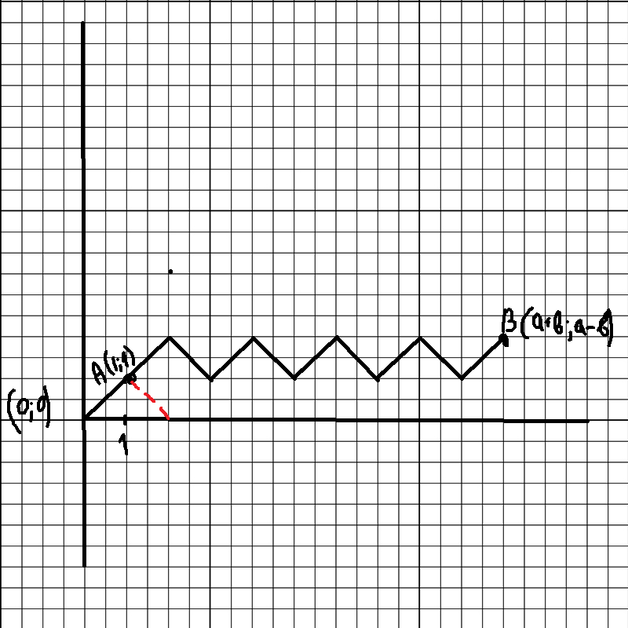
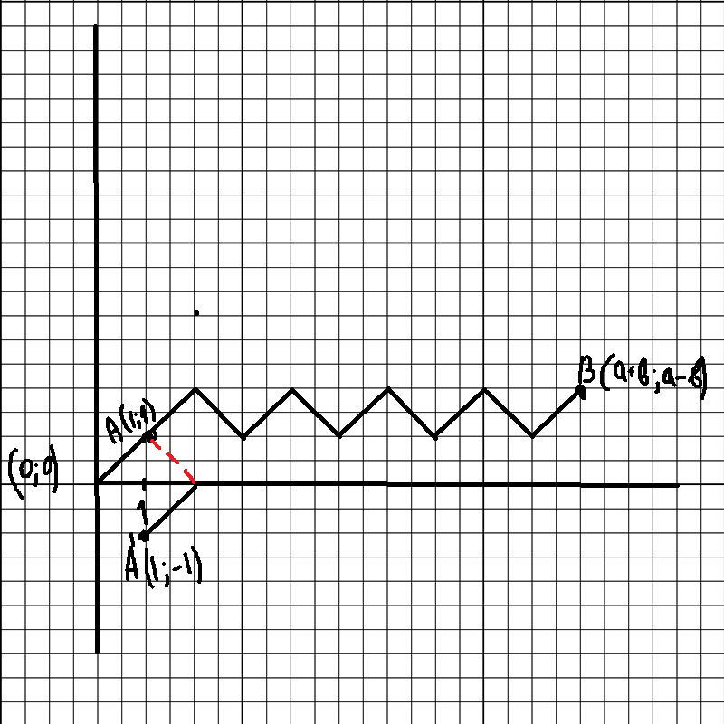
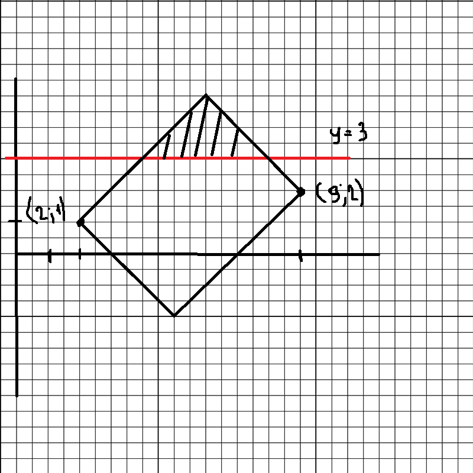

#### Задача на нахождение количества путей из $A$ в $B$

1. *Нахождение количества путей из начала координат в некую точки без пересечения оси $x$*

Для нахождения числа путей из начала координат необходимо:

1. Выбрать более удобную точку $A(1;1)$
2. Найти количество путей (вообще всех) из $A$ в $B$.
3. Вычесть количество "плохих" путей (путей, которые касаются или пересекают ось $x$) 
4. Полученное в п.3 число вычесть из количество всех путей из начала координат в точку $B$

Количество всех путей из $A(1;1)$ в $B$ равно
$$
N_{x,y}=
\begin{pmatrix}
a+b-1\\
a-1
\end{pmatrix}
$$
Затем мы применяем теорему об отражении и получаем точку $A'(1;-1)$

И для нее считаем количество "плохих" путей
$$
N_{x,y'}=\begin{pmatrix}
a+b-1\\
a
\end{pmatrix}
$$
Таким образом количество путей из A в B не касающихся $x$ равно 
$$
N=\begin{pmatrix}
a+b-1\\
a-1
\end{pmatrix} - 
\begin{pmatrix}
a+b-1\\
a
\end{pmatrix} = 
\frac{(a+b-1)!}{(a-1)!b!}-\frac{(a+b-1)!}{a!(b-1)!}=\frac{(a+b-1)!}{(a-1)!b!}\left(1-\frac{b}{a}\right)=\\=\frac{(a+b-1)!(a-b)}{a!b!}
$$
Количество вообще всех путей из начала координат в точку $B$ равно
$$
N=\begin{pmatrix}
a+b\\
a
\end{pmatrix}=\frac{(a+b)!}{a!b!}
$$
Чтобы получить вероятность, что случайный путь из 0 в B не будет касатся $x$
$$
\frac{(a+b-1)!(a-b)}{a!b!}:\frac{(a+b)!}{a!b!}=\frac{a-b}{a+b}
$$

2. *Нахождение количества путей из точки $A(x_1,y_1)$ в $B(x_2,y_2)$ без пересечения прямой $y=k$*

В данном случае ход решения сильно не отличается (параллельно с формулами будет идти решение примера выше)

1. Найти количество всех путей
2. По лемме об отражении построить точку $A'(x_1,y'_1=2k-y_1)$
3. Найти общее количество путей
4. Найти количество "плохих" путей
5. Вычесть из числа, полученного в п.3, число, полученное в п.4

Общее количество путей находим по формуле
$$
N_{x,y}=\begin{pmatrix}
x_2-x_1\\
\frac{x_2-x_1+y_2-y_1}{2}
\end{pmatrix}=\begin{pmatrix}
9-2\\
\frac{9-2+2-1}{2}
\end{pmatrix}=
\begin{pmatrix}
7\\
4
\end{pmatrix}=
\frac{7!}{4!3!}=35
$$
Количество "плохих" путей 
$$
N_{x,y'}=\begin{pmatrix}
x_2-x_1\\
\frac{x_2-x_1+y_2-y'_1}{2}
\end{pmatrix}=
\begin{pmatrix}
x_2-x_1\\
\frac{x_2-x_1+y_2-(2k-y_1)}{2}
\end{pmatrix}=\begin{pmatrix}
9-2\\
\frac{9-2+2-(2*3-1)}{2}
\end{pmatrix}=
\begin{pmatrix}
7\\
2
\end{pmatrix}=\frac{7!}{2!5!}=21
$$
Всего путей, которые не пересекают заданную прямую равно $N = N_{x,y} - N_{x,y'} = 35-21 = 14$ (сидел лично проводил прямые и считал их количество, все верно)