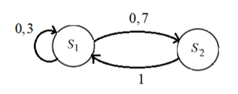

#### Задача 2
##### Цепи Маркова

**Пример 1**
Найдем стационарное распределение:

Матрица переходов 
$$
P=(p_{ij})=
\begin{pmatrix}
0,3 & 0.7 \\
1 & 0
\end{pmatrix}
$$
Стационарное распределение будет иметь вид $\pi = (\pi_1, \pi_2)$. Мы знаем, что вектор распределения вероятностей на любом шаге можно найти по рекуррентной формуле $p(n)=p(n-1)P$. Т.к. по своству стационарного распределения оно обозначает, что распределение вероятностей на шаге $n \rightarrow \infin$ не отличается от распределения на шаге $n+1 \rightarrow \infin$. Получаем что
$$
\pi=\pi \cdot P \\
\begin{cases}
0,3\pi_1+\pi_2=\pi_1 \\
0,7\pi_1+0\pi_2=\pi_2 \\
\pi_1 + \pi_2 = 1
\end{cases}
$$
Решив систему получим 
$$
\begin{cases}
\pi_1=\frac{10}{17}\\
\pi_2=\frac{7}{17}
\end{cases}
$$
*Переводя на человеческий язык*: данная система, независимо от начального состояния, на шаге $n \rightarrow \infin $ будет с вероятностью $\pi_1$ в состоянии $S_1$ (или с вероятностью $\pi_2$ в состоянии $S_2$)

**Пример 2**

Задана матрица переходных вероятностей
$$
P =
\begin{pmatrix}
0.4 & 0.6 \\
0.3 & 0.7
\end{pmatrix}
$$

*Задача*:
Найти матрицу $P_2$ (*простыми словами*, найти распределение в каком состоянии будет система на 2ом шаге)

*Решение*:
Найдем матрицу $P_2$ 
$$ 
P_2 = P_1 \cdot P_1 = (\text{*перемножение матриц*}) = 
\begin{pmatrix}
0.34 & 0.66 \\
0.33 & 0.67
\end{pmatrix}
$$

*Задача*:
Найдем распределение вероятностей по состояниям системы в момент $t=2$. Начальное распределение $q=(0,1;0,9)$ (система с вер. 0.1 начинает работу с состояния 1, и с вер. 0.9 с состояния 2)

*Решение*: 
$$
p(2)=q\cdot P_2 = (0.1, 0.9)
\begin{pmatrix}
0.34 & 0.66 \\
0.33 & 0.67
\end{pmatrix} 
= (0.331, 0.669) 
$$
Система с вероятностью 0.669 (при начальном состоянии (0.1, 0.9)) будет в состоянии 2 после двух шагов.

*Задача*:
Найдем стационарное распределение системы (вероятностное распределение в каком состоянии будет система после $n \rightarrow \infin$ шагов при любом начальном состоянии)

*Решение*:
Т.к при очень большом n значения $p(n)$ и $p(n+1)$ стремятся к одному значению (они бесконечно очень близки). А это значит что(сделам замену)
$$
p(n+1)=p(n)P \\
\pi=\pi P
$$
где $\pi$ - стационарное распределение.
Это $\pi$ можно найти решив систему. В данном случае 
$$
\begin{cases}
\pi_1=0.4\pi_1 + 0.3\pi_2\\
\pi_2=0.6\pi_1 + 0.7\pi_2\\
\pi_1+\pi_2=1
\end{cases}
$$
Решив эту систему получим 
$$
\pi=\{\frac{1}{3};\frac{2}{3}\}
$$
Это означает что система, на бесконечно большом шаге, будет с вероятностью $\frac{2}{3}$ в состоянии 2

**Пример 3**

Дано 
$$
\pi = \begin{pmatrix}
0,1m\;\;\;0,3n\;\;\;p_1\\
0,2n\;\;\;p_2\;\;\;0,4m\\
p_3\;\;\;0,4m\;\;\;0,5n
\end{pmatrix};\;\;\;P_0=(0,3m;0,4n;q)
$$
где $n,m\in N$, $p_i$ - вероятность состояния $i$ в некоторый момент времени, $P_j$ - вероятностное распределение в момент времени $j$.  

Возьмем $n = 5, m = 1$
$$
\pi = \begin{pmatrix}
0,11\;\;\;0,35\;\;\;p_1\\
0,25\;\;\;p_2\;\;\;0,41\\
p_3\;\;\;0,41\;\;\;0,55
\end{pmatrix};\;\;\;P_0=(0,31;0,45;q)
$$

1. Найти недостающие элементы матрицы ($p_i, q$)

Найдем $p_i$:
$$
\sum\limits_{i=1}^3p_{ji}=1
$$
то есть сумма в строке матрицы должна быть равна единице $\Rightarrow$ 
$$
p_1 = 1 -0,11 - 0,25 = 0,54\\
p_2 = 1 - 0,25 - -0,41 = 0,34\\
p_3 = 1 - 0,41 - 0,55 = 0,04
$$
Аналогично $q = 1 - 0,31 - 0,45 = 0,24$

2. Найти вероятностное распределение в момент времени 2 $(P_2)$

Для этого необходимо умножить вектор-строку $P_0$ на матрицу $\pi$
$$
P_1 = P_0\cdot\pi=(0,1562;\;0,3599;\;0,4839)
$$
И повторить данное действие для нахождения распределения в момент времени 2
$$
P_2 = P_1\cdot\pi=(0,126513;\;0,375435;\;0,498052)
$$

3. Определить вероятность состояния $2$ в момент времени $3$.

Для определения вероятности состояния 2 в момент времени 3 найдем $P_3$, но только второе состояние
$$
P(X(3)=2) = (a_{12}\cdot p_1+a_{22}\cdot p_2+a_{32}\cdot p_3)=\\=(0,35\cdot 0,126513+0,34\cdot 0,375435 + 0,41\cdot 0,498052) = 0,37612877
$$

4. Найти стационарное(предельное) распределение

Для нахождения стационарного распределения необходимо решить систему
$$
\begin{cases}
\pi_1 = 0,11\pi_1+0,25\pi_2+0,04\pi_3\\
\pi_2=0,35\pi_1+0,34\pi_2+0,41\pi_3\\
\pi_3=0,54\pi_1+0,41\pi_2+0,55\pi_3\\
\pi_1+\pi_2+\pi_3=1
\end{cases}
$$
Решив систему получим
$$
\pi_1= (1289/10077), \pi_2= (1263/3359), \pi_3= (4999/10077)
$$
